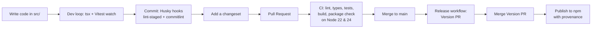
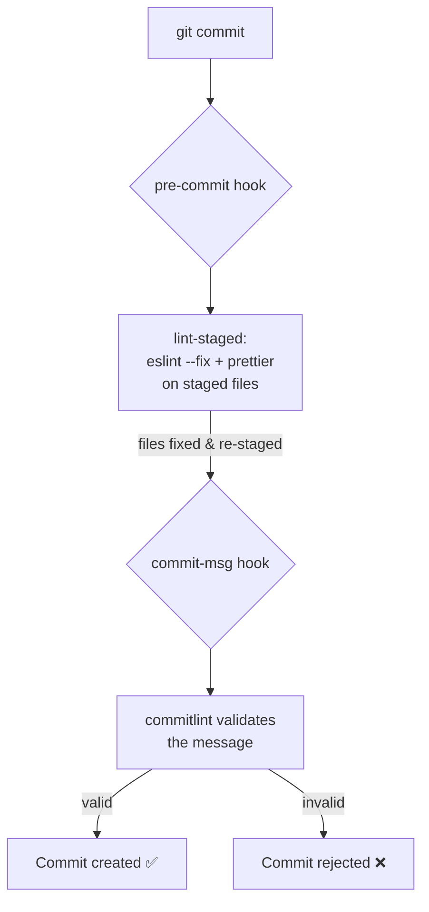
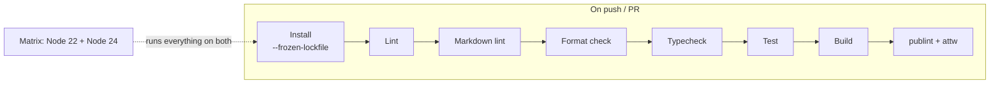
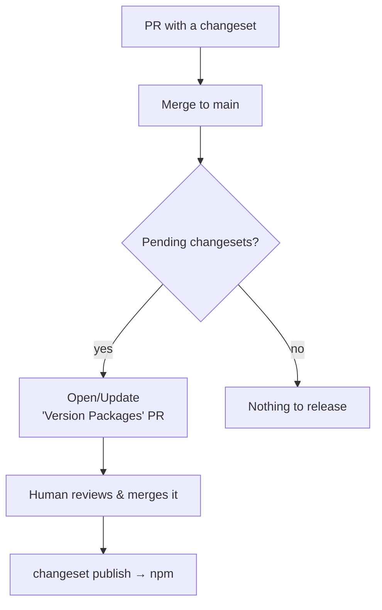

# Project Guide — Learn this TypeScript library setup from scratch

> A guided tour of **every tool, file, and decision** in this repository, written for a
> junior developer. For each piece you'll learn **what it is**, **what problem it
> solves**, **why we chose it** (and why not the alternatives), and you'll get a small
> **"Try it"** exercise so you learn by doing.

This is not API documentation. It's a learning document about _how a modern, publishable
TypeScript library is configured and why_.

---

## How to read this guide

Every section follows the same template:

- **What it is** — a plain-language definition.
- **Why we did it this way** — the reasoning behind the decision.
- **Alternatives (and why not)** — what else exists and the trade-offs.
- **Try it 🧪** — a hands-on exercise to cement the idea.
- **Learn more 📚** — official docs to go deeper.

Suggested learning path (each builds on the previous one):

1. [The big picture](#1-the-big-picture) — how everything connects.
2. [TypeScript & the compiler config](#2-typescript--the-compiler-config) ⭐ _must-know_
3. [Modules & ESM](#3-modules--esm) ⭐ _must-know_
4. [The package manager (pnpm)](#4-the-package-manager-pnpm)
5. [Building & running](#5-building--running)
6. [Code quality: ESLint, Prettier & markdownlint](#6-code-quality-eslint-prettier--markdownlint) ⭐
7. [Testing with Vitest](#7-testing-with-vitest) ⭐
8. [Git hygiene: hooks & commit conventions](#8-git-hygiene-hooks--commit-conventions)
9. [Continuous Integration (CI)](#9-continuous-integration-ci)
10. [Versioning & releases (Changesets)](#10-versioning--releases-changesets)
11. [Publish validation & packaging](#11-publish-validation--packaging)
12. [Dependency maintenance (Dependabot)](#12-dependency-maintenance-dependabot)
13. [Developer experience & environment](#13-developer-experience--environment)
14. [Repository meta files](#14-repository-meta-files)
15. [Glossary](#15-glossary)
16. [FAQ & common errors](#16-faq--common-errors)

> ⭐ = the concepts you should understand first; the rest you can absorb as you need them.

---

## 1. The big picture

This project is a **library**: code meant to be installed and imported by _other_
projects (via `npm install`), not run as an app. That single fact drives almost every
decision: we care a lot about the **published output**, **type safety**, and **a smooth
contributor workflow**.

Here's how a change travels from your editor to a published package:



Each box maps to a section below. The rest of the guide explains the _tools_ inside
each box and _why_ they're configured the way they are.

**Try it 🧪** — Before reading further, open these files and just skim them; you'll
understand them by the end of this guide:
[`package.json`](../package.json), [`tsconfig.json`](../tsconfig.json),
[`eslint.config.ts`](../eslint.config.ts), [`vitest.config.ts`](../vitest.config.ts),
[`.github/workflows/ci.yml`](../.github/workflows/ci.yml).

---

## 2. TypeScript & the compiler config

### What it is

[TypeScript](https://www.typescriptlang.org/) is JavaScript with **static types**. You
write `.ts`, and the compiler (`tsc`) both **checks types** (catches bugs before running)
and **emits** plain `.js` plus `.d.ts` type-definition files for consumers.

The behavior of `tsc` is controlled by [`tsconfig.json`](../tsconfig.json). This project
actually uses **three** tsconfig files — that split is itself a deliberate decision:

| File                                              | Purpose                                                                                                                |
| ------------------------------------------------- | ---------------------------------------------------------------------------------------------------------------------- |
| [`tsconfig.json`](../tsconfig.json)               | The **base**. Used by the editor, type-checking, and as the parent of the others.                                      |
| [`tsconfig.build.json`](../tsconfig.build.json)   | The **build**. Extends the base but **excludes tests** so they don't end up in `dist/`.                                |
| [`tsconfig.eslint.json`](../tsconfig.eslint.json) | For **type-aware linting**. Extends the base and also includes root `*.ts` config files so ESLint can type-check them. |

### Why we did it this way

- **One base, two overrides** keeps settings in a single place (DRY). The build and lint
  configs only change `include`/`exclude`, inheriting all the strict options.
- **Tests excluded from the build** ([`tsconfig.build.json`](../tsconfig.build.json)):
  your published package should contain library code, not test files. We _don't_ exclude
  tests from the base config, because the editor and the linter _do_ want to type-check
  them while you work.

The base config turns on a lot of strictness on purpose. The important flags:

| Flag                                    | What it does                                                                              | Why                                                                   |
| --------------------------------------- | ----------------------------------------------------------------------------------------- | --------------------------------------------------------------------- |
| `strict`                                | Enables all the core strict checks (e.g. `strictNullChecks`).                             | The single most valuable setting in TS. Non-negotiable for a library. |
| `noUncheckedIndexedAccess`              | `arr[i]` is typed as `T \| undefined`.                                                    | Forces you to handle the "what if it's missing?" case.                |
| `exactOptionalPropertyTypes`            | `{ x?: number }` is not the same as `{ x: number \| undefined }`.                         | Models optional-vs-undefined precisely; avoids subtle bugs.           |
| `verbatimModuleSyntax`                  | Imports/exports are emitted exactly as written; type-only imports must say `import type`. | Predictable ESM output, no accidental runtime imports of types.       |
| `isolatedModules`                       | Each file must be compilable alone.                                                       | Compatibility with single-file transpilers (esbuild/swc/Vitest).      |
| `noUnusedLocals` / `noUnusedParameters` | Errors on dead variables.                                                                 | Keeps code clean; catches mistakes.                                   |
| `declaration` + `declarationMap`        | Emits `.d.ts` and `.d.ts.map`.                                                            | Consumers get types **and** "Go to Definition" into your source.      |
| `sourceMap`                             | Emits `.js.map`.                                                                          | Lets consumers debug into the original `.ts`.                         |
| `moduleDetection: force`                | Every file is treated as a module.                                                        | No accidental global scripts.                                         |
| `module: nodenext` / `target: es2023`   | Modern Node module resolution; compile down to ES2023.                                    | Matches the Node `>=22` we support; see notes below.                  |

A note on **`target: es2023`** (not `esnext`): `esnext` is a _moving target_ — its
meaning changes as TypeScript updates, so your emitted JavaScript could change between TS
versions. Pinning to a concrete year (`es2023`) makes the build **reproducible** and
predictable for consumers. We picked `es2023` because it's safely supported by Node 22+.

### Full `tsconfig.json` reference

Every option in [`tsconfig.json`](../tsconfig.json), in plain language:

#### Paths & output

- `rootDir: "./src"` — where your source code lives.
- `outDir: "./dist"` — where the compiled output is written.

#### Modules & language version

- `module: "nodenext"` — use Node's modern module system (ESM with `import`).
- `target: "es2023"` — which JavaScript version your code is translated to.
- `lib: ["es2023"]` — which language APIs you're allowed to use.
- `types: ["node"]` — load Node's types (`process`, `fs`, …).

#### File generation

- `sourceMap: true` — emit `.js.map` so consumers can debug into the original `.ts`.
- `declaration: true` — emit `.d.ts` (the types for whoever installs the library).
- `declarationMap: true` — emit `.d.ts.map` so "Go to Definition" jumps into your `.ts`.
- `resolveJsonModule: true` — allow `import data from './x.json'`.

#### Safety & strictness

- `forceConsistentCasingInFileNames: true` — `./File` and `./file` can't be mixed (matters on Linux).
- `noUncheckedIndexedAccess: true` — `arr[i]` is typed `T | undefined`, forcing you to handle the missing case.
- `exactOptionalPropertyTypes: true` — distinguishes "property absent" from "property = undefined".
- `noImplicitReturns: true` — every code path in a function must return (or none).
- `noImplicitOverride: true` — overriding a parent method requires the `override` keyword.
- `noUnusedLocals: true` — error on declared-but-unused variables.
- `noUnusedParameters: true` — error on unused parameters.
- `noFallthroughCasesInSwitch: true` — prevents forgetting `break` in a `switch`.
- `strict: true` — enables the full bundle of strict checks (the single most important one).

#### Modern modules

- `verbatimModuleSyntax: true` — emit imports exactly as written; type-only imports must use `import type`.
- `isolatedModules: true` — each file must be compilable on its own (compatible with esbuild/Vitest).
- `noUncheckedSideEffectImports: true` — warn if you side-effect-import a module that doesn't exist.
- `moduleDetection: "force"` — treat every file as a module (no accidental global scripts).

#### Performance

- `skipLibCheck: true` — don't type-check the internals of third-party `.d.ts` files (faster builds).

#### Scope

- `include: ["src"]` — which folders are compiled.
- `exclude: ["node_modules", "dist"]` — which folders are ignored.

### Alternatives (and why not)

- **A bundler (tsup / Rollup / esbuild) instead of `tsc`** — bundlers are great for apps
  and for emitting both ESM and CommonJS. For a small ESM-only library, plain `tsc` is
  simpler, has zero extra dependencies, and produces accurate `.d.ts` + maps. If this
  library later needed CJS output or to bundle many files into one, a bundler would earn
  its place.
- **Babel for compilation** — Babel strips types but cannot _check_ them or emit `.d.ts`.
  You'd still need `tsc` for types, so it adds a tool without removing one.
- **A single tsconfig** — simpler, but then either tests leak into your build or the
  editor can't type-check them. The 3-file split avoids both.

### Try it 🧪

1. In [`src/index.ts`](../src/index.ts), add `const unused = 1;` and run `pnpm typecheck`.
   Watch `noUnusedLocals` reject it.
2. Run `pnpm build`, then open `dist/index.js`. Notice the arrow function survived intact
   (because `target` is modern). Change `target` to `"es5"` in
   [`tsconfig.json`](../tsconfig.json), rebuild, and see the arrow function get rewritten
   into a `function`. Then revert.

### Learn more 📚

- [TSConfig reference](https://www.typescriptlang.org/tsconfig)
- [The TSConfig "Cheat Sheet"](https://www.totaltypescript.com/tsconfig-cheat-sheet)

---

## 3. Modules & ESM

### What it is

JavaScript has two module systems: the old **CommonJS** (`require`/`module.exports`) and
the modern standard **ES Modules / ESM** (`import`/`export`). This project is
**ESM-only**, declared by `"type": "module"` in [`package.json`](../package.json#L5).

The published entry points are declared by the **`exports` map**:

```jsonc
"main": "./dist/index.js",          // legacy fallback
"types": "./dist/index.d.ts",       // legacy types fallback
"exports": {
  ".": {
    "types": "./dist/index.d.ts",   // what TypeScript reads
    "default": "./dist/index.js"    // what the runtime imports
  },
  "./package.json": "./package.json" // let tools read our package.json
}
```

### Why we did it this way

- **ESM-only** is where the ecosystem is heading; it's simpler to ship one format
  correctly than to ship two and validate both. Node 22+ supports ESM natively.
- The **`exports` field** is the modern, strict way to declare your public API. Unlike
  the old `main`, it _prevents_ consumers from importing internal files you didn't intend
  to expose ("encapsulation"). We keep `main`/`types` too as a fallback for very old
  tooling.
- **Order matters** inside an export condition: `types` must come first so TypeScript
  resolves it before the runtime `default`.
- `"sideEffects": false` ([package.json](../package.json#L17)) tells bundlers "importing
  this package has no side effects," enabling **tree-shaking** (dead-code elimination) in
  consumer apps.

A subtle but important rule you'll hit: **in ESM, relative imports need the file
extension, and it's `.js` even from a `.ts` file**. Look at
[`src/index.test.ts`](../src/index.test.ts): it imports `from './index.js'`, not
`'./index'` or `'./index.ts'`. That's because the import path refers to the _compiled
output_, and ESM requires explicit extensions. `verbatimModuleSyntax` enforces this.

### Alternatives (and why not)

- **CommonJS-only** — maximally compatible with old code, but it's the legacy format;
  new libraries shouldn't start there.
- **Dual ESM + CJS** — broadest compatibility, but it doubles the build complexity and is
  a famous source of the "dual package hazard" (two copies of your module loaded at once).
  Only worth it if you must support CJS-only consumers.

### Try it 🧪

In a scratch folder, run `node --input-type=module -e "import('typescript-library-seed')"`
after building — wait, it's not installed there. Instead: open `dist/index.js` after
`pnpm build` and confirm it uses `export const`, proving it's ESM. Then try changing the
test import to `'./index'` (no extension) and run `pnpm test:run` — watch it fail to
resolve.

### Learn more 📚

- [Node.js: package `exports`](https://nodejs.org/api/packages.html#exports)
- ["Pure ESM package" guide](https://gist.github.com/sindresorhus/a39789f98801d908bbc7ff3ecc99d99c)

---

## 4. The package manager (pnpm)

### What it is

[pnpm](https://pnpm.io/) installs your dependencies. It's an alternative to `npm` and
`yarn`. The project pins it with `"packageManager": "pnpm@11.6.0"` in
[`package.json`](../package.json), which **Corepack** (built into Node) reads to use the
exact right version automatically.

### Why we did it this way

- **Speed & disk efficiency** — pnpm stores one global copy of each package version and
  hard-links it into projects, so installs are fast and take far less disk.
- **Strictness** — pnpm's `node_modules` layout prevents "phantom dependencies" (using a
  package you never declared). This catches bugs that npm would hide.
- **`packageManager` + Corepack** — guarantees everyone (and CI) uses the _same_ pnpm
  version, so "works on my machine" problems disappear.
- **`pnpm-lock.yaml`** — the lockfile pins the exact resolved versions of every
  dependency. CI installs with `--frozen-lockfile` so it fails if the lockfile is out of
  date rather than silently changing versions.
- [`pnpm-workspace.yaml`](../pnpm-workspace.yaml) — here it just contains
  `ignoredBuiltDependencies: [esbuild]`. Since pnpm 10, dependency build scripts are
  **blocked by default** for security; this line documents that we intentionally don't run
  esbuild's build step (it's a transitive dependency we don't need compiled).

### Alternatives (and why not)

- **npm** — ships with Node, zero setup, but slower and looser (allows phantom deps).
- **yarn** — fine, but pnpm has become the community favorite for libraries thanks to its
  strictness and efficiency.
- **Bun** — very fast and promising, but newer; pnpm is the safer, more universally
  supported default today.

### Try it 🧪

Run `pnpm why typescript` to see who depends on TypeScript. Then run
`pnpm install --frozen-lockfile` and notice it does nothing because the lockfile already
matches — that's what CI relies on.

### Learn more 📚

- [pnpm docs](https://pnpm.io/motivation)
- [Corepack](https://nodejs.org/api/corepack.html)

---

## 5. Building & running

### What it is

Two scripts cover the two things you do with code: **run it while developing** and
**compile it for shipping**.

- `pnpm dev` → `tsx watch src/index.ts`: runs TypeScript directly, re-running on save.
- `pnpm build` → `tsc -p tsconfig.build.json`: compiles `src/` into `dist/`.
- `pnpm clean` → `rimraf dist`: deletes the build output (cross-platform `rm -rf`).

### Why we did it this way

- **[tsx](https://tsx.is/) for development** — it runs `.ts` files instantly with no
  build step and no config, so your edit→run loop is fast. It uses esbuild under the hood,
  which transpiles (strips types) without type-checking — that's fine for running; the
  _checking_ is done separately by `pnpm typecheck`.
- **`tsc` for the build** — for the artifact you publish, you want the real TypeScript
  compiler because only it emits accurate `.d.ts` type definitions and declaration maps.
- **`rimraf` for clean** — `rm -rf` doesn't exist on Windows; `rimraf` is the portable
  equivalent so the script works for every contributor.

### Alternatives (and why not)

- **`ts-node`** instead of `tsx` — older and slower to start; `tsx` is the modern choice.
- **`node --experimental-strip-types`** — Node can now run some TS directly, but it's
  still maturing and doesn't cover every case; `tsx` is reliable today.

### Try it 🧪

Run `pnpm dev`. While it's watching, edit [`src/index.ts`](../src/index.ts) to change the
greeting, save, and watch it re-run. Stop it with `Ctrl+C`.

### Learn more 📚

- [tsx documentation](https://tsx.is/)

---

## 6. Code quality: ESLint, Prettier & markdownlint

### What it is

- **[ESLint](https://eslint.org/)** finds _problems_ (bugs, risky patterns). Configured
  in [`eslint.config.ts`](../eslint.config.ts).
- **[Prettier](https://prettier.io/)** enforces _formatting_ (spacing, quotes, line
  width). Configured in [`.prettierrc`](../.prettierrc).
- **[markdownlint](https://github.com/DavidAnson/markdownlint)** (via
  [`markdownlint-cli2`](https://github.com/DavidAnson/markdownlint-cli2)) lints the
  _Markdown_ docs for structural issues Prettier doesn't catch. Configured in
  [`.markdownlint.jsonc`](../.markdownlint.jsonc); run with `pnpm lint:md`.

They do different jobs and are used together: **ESLint for code correctness, Prettier for
style, markdownlint for documentation quality.**

### Why we did it this way

- **Flat config (`eslint.config.ts`)** — ESLint's modern configuration format (the old
  `.eslintrc` is deprecated). Writing it in TypeScript gives autocomplete and type safety
  on the config itself.
- **Type-aware linting** — we enable
  [`typescript-eslint`](https://typescript-eslint.io/)'s `strictTypeChecked` and
  `stylisticTypeChecked` rule sets. These rules can use _type information_ to catch deep
  bugs (e.g. floating promises, unsafe `any`) that text-only linters miss. The
  `projectService` setting wires ESLint to the TypeScript program so it knows the types.
- **`eslint-config-prettier` is listed last** — it _turns off_ all ESLint rules that
  would fight with Prettier, so the two tools never disagree about formatting. Order
  matters: it must come last to win.
- **Prettier settings** ([`.prettierrc`](../.prettierrc)) are mostly defaults plus a few
  conventions: single quotes, trailing commas everywhere (cleaner diffs), 80-column width,
  LF line endings (consistent across OSes).
- **markdownlint complements Prettier on docs** — Prettier formats Markdown but doesn't
  enforce _structure_ (heading increments, list consistency, fenced-code languages, bare
  URLs…). `markdownlint-cli2` reads [`.markdownlint.jsonc`](../.markdownlint.jsonc), runs in
  CI (`pnpm lint:md`) and auto-fixes staged files via lint-staged. Run it _before_ Prettier
  in lint-staged so Prettier formats last and the two don't fight over the result.

### Alternatives (and why not)

- **Biome** — an all-in-one, very fast linter+formatter (Rust). Genuinely compelling, but
  the ESLint + Prettier + `typescript-eslint` combination still has the deepest
  type-aware rules and the largest ecosystem. A reasonable future swap.
- **ESLint's own formatting rules** — deprecated; the community standard is "let Prettier
  format, let ESLint lint."

### Try it 🧪

1. In [`src/index.ts`](../src/index.ts), mangle the spacing (e.g. `export  const  greet`)
   and run `pnpm format` — Prettier fixes it.
2. Write `const x: any = 1;` and run `pnpm lint` — `strictTypeChecked` will warn about the
   unsafe `any`.

### Learn more 📚

- [typescript-eslint: shared configs](https://typescript-eslint.io/users/configs)
- [Why Prettier + ESLint](https://prettier.io/docs/en/integrating-with-linters.html)

---

## 7. Testing with Vitest

### What it is

[Vitest](https://vitest.dev/) is the test runner. Configuration lives in
[`vitest.config.ts`](../vitest.config.ts); an example test is
[`src/index.test.ts`](../src/index.test.ts).

### Why we did it this way

- **Vitest over Jest** — Vitest is fast, ESM-native, and uses the same config style as
  Vite. It works out-of-the-box with TypeScript and ESM, which Jest only does with extra
  configuration.
- **Colocated tests** — tests live _next to_ the code they test (`index.ts` ↔
  `index.test.ts`) instead of a separate `tests/` folder. This keeps related files
  together and is the dominant modern convention. (They're excluded from the build by
  [`tsconfig.build.json`](../tsconfig.build.json), so they never ship.)
- **Explicit imports (no `globals`)** — tests `import { describe, it, expect } from 'vitest'`
  rather than relying on Jest-style globals. This is Vitest's default and the current
  recommendation: it gives better type inference, avoids adding `vitest/globals` to
  `tsconfig`'s `types`, and keeps each file self-describing. Flip `globals: true` in
  [`vitest.config.ts`](../vitest.config.ts) if you prefer the implicit style.
- **v8 coverage with 80% thresholds** — the config measures how much code your tests
  exercise and **fails** if any metric drops below 80%. Thresholds turn coverage from a
  vanity number into an enforced quality gate.

### Alternatives (and why not)

- **Jest** — the long-time standard, huge ecosystem, but heavier ESM/TS setup.
- **node:test** (Node's built-in runner) — zero dependencies, but a thinner feature set
  and weaker watch/coverage DX than Vitest.

### Try it 🧪

1. Run `pnpm test` (watch mode). Edit the test to expect the wrong value and watch it go
   red, then fix it.
2. Run `pnpm test:coverage`. Add an unused exported function to
   [`src/index.ts`](../src/index.ts) without a test and watch coverage drop below the
   threshold and fail the command.

### Learn more 📚

- [Vitest guide](https://vitest.dev/guide/)
- [Coverage configuration](https://vitest.dev/guide/coverage.html)

---

## 8. Git hygiene: hooks & commit conventions

### What it is

A set of tools that keep the Git history clean and catch problems _before_ they're
committed:

- **[Husky](https://typicode.github.io/husky/)** runs scripts on Git events (hooks). See
  [`.husky/`](../.husky/).
- **[lint-staged](https://github.com/lint-staged/lint-staged)** runs linters/formatters
  only on the files you're committing.
- **[commitlint](https://commitlint.js.org/)** validates commit _messages_.
- **[Commitizen](https://commitizen-tools.github.io/commitizen/)** (`pnpm commit`) gives
  you an interactive prompt to write a well-formed commit.

### Why we did it this way

- **`pre-commit` hook → lint-staged** ([.husky/pre-commit](../.husky/pre-commit)): before
  each commit, it auto-fixes ESLint issues and formats with Prettier — but **only on
  staged files**, so it's fast and never touches unrelated code.
- **`commit-msg` hook → commitlint** ([.husky/commit-msg](../.husky/commit-msg)):
  validates your message against **[Conventional Commits](https://www.conventionalcommits.org/)**
  (`feat:`, `fix:`, `chore:`…). This isn't bureaucracy — it's what lets **Changesets**
  and changelogs work automatically later.
- **Why enforce at commit time?** Catching issues locally is faster and cheaper than
  failing in CI. The hooks are a safety net, and CI is the backstop.

### How it's wired

The whole chain is set up from four places:

1. **Installation (automatic).** `package.json` has `"prepare": "husky"`. pnpm runs the
   `prepare` script after every `pnpm install`, which activates Husky by pointing Git's
   hooks at the `.husky/` directory (`core.hooksPath = .husky/_`). No manual setup needed.

2. **The hook files** in [`.husky/`](../.husky/) — each is a tiny script Git runs on an
   event:

   ```sh
   # .husky/pre-commit
   pnpm exec lint-staged

   # .husky/commit-msg
   pnpm exec commitlint --edit $1   # $1 is the file holding your commit message
   ```

3. **What lint-staged runs** (configured in [`package.json`](../package.json)) — only on
   the files you staged:

   ```jsonc
   "lint-staged": {
     "*.{ts,tsx}": ["eslint --fix", "prettier --write"],
     "*.md": ["markdownlint-cli2 --fix", "prettier --write"],
     "*.json": ["prettier --write"]
   }
   ```

4. **What commitlint validates** ([`commitlint.config.ts`](../commitlint.config.ts)) — it
   extends the Conventional Commits ruleset:

   ```ts
   export default { extends: ['@commitlint/config-conventional'] };
   ```

So a `git commit` with an empty/non-conventional type (e.g. `"fix stuff"`) is rejected
with `type may not be empty`, while `feat: add X` passes. Run `pnpm commit` (Commitizen)
for a guided prompt that builds a valid message for you.

### How a commit flows



### Alternatives (and why not)

- **No hooks** — simpler, but quality problems slip into history and only surface in CI
  (or never). For a shared/published project, the small friction is worth it.
- **Other hook managers** (simple-git-hooks, lefthook) — fine choices; Husky is the most
  widely used and well-documented.

### Try it 🧪

Run `git commit -m "broke the rules"` (no Conventional Commit prefix) — commitlint
rejects it. Then try `pnpm commit` for the guided experience, or
`git commit -m "docs: try the guide"`.

### Learn more 📚

- [Conventional Commits spec](https://www.conventionalcommits.org/)
- [Husky get started](https://typicode.github.io/husky/get-started.html)

---

## 9. Continuous Integration (CI)

### What it is

[GitHub Actions](https://docs.github.com/actions) automatically runs checks on every push
and pull request. The workflow is [`.github/workflows/ci.yml`](../.github/workflows/ci.yml).

### Why we did it this way

The CI job runs the **same checks you run locally**, in order: lint → markdown lint →
format check → typecheck → test → build → package validation. If it's green, the change is
safe to merge.

Key decisions:

- **Matrix on Node 22 and 24** — a published library must work on every Node version it
  claims to support (`engines: ">=22"`). The matrix runs the whole suite on both the LTS
  (22) and the current (24) versions to catch version-specific breakage.
- **`fail-fast: false`** — if one Node version fails, the others keep running to completion
  instead of being cancelled. You see _every_ version's result in one go, so you know
  whether a bug is version-specific or universal.
- **`concurrency` with `cancel-in-progress: true`** — if you push twice quickly, the older
  run is cancelled so CI isn't wasting time on outdated code.
- **`cache: pnpm`** — caches the dependency store between runs so installs are fast.
- **`--frozen-lockfile`** — CI fails if `pnpm-lock.yaml` doesn't match `package.json`,
  preventing accidental dependency drift.



### Security scanning (CodeQL)

A second workflow, [`.github/workflows/codeql.yml`](../.github/workflows/codeql.yml), runs
GitHub's [CodeQL](https://codeql.github.com/) static analysis. It scans the code for
security vulnerabilities (injection, unsafe patterns…) on every push/PR to `main` and on a
weekly schedule, publishing findings to the repo's **Security** tab. It's kept separate
from `ci.yml` because it has a different cadence (the weekly `cron` catches advisories
published _after_ code stops changing) and needs the `security-events: write` permission to
upload results. The `security-extended` query suite adds checks beyond the default set.

> A reasonable next hardening step (not done here to keep the workflows readable) is
> **pinning each action to a full commit SHA** instead of a moving tag like `@v4`, as
> recommended by [OpenSSF Scorecard](https://github.com/ossf/scorecard). Dependabot's
> `github-actions` updates already keep the tags current.

### Alternatives (and why not)

- **Other CI providers** (CircleCI, GitLab CI…) — all valid; GitHub Actions is the
  default when the code lives on GitHub (zero extra setup, tight integration).
- **A single Node version** — simpler, but you'd miss bugs that only appear on a version
  your users run.

### Try it 🧪

Open a branch, intentionally break the test, push, and open a PR. Watch the CI job go red
and block the merge. (Then fix it.)

### Learn more 📚

- [GitHub Actions: workflow syntax](https://docs.github.com/actions/using-workflows/workflow-syntax-for-github-actions)

---

## 10. Versioning & releases (Changesets)

### What it is

[Changesets](https://github.com/changesets/changesets) automates **versioning** and
**publishing**. You describe each change in a small file; the tooling figures out the new
version number, writes the changelog, and publishes. Configured in
[`.changeset/config.json`](../.changeset/config.json); automated by
[`.github/workflows/release.yml`](../.github/workflows/release.yml).

### Why we did it this way

- **Semantic Versioning (semver)** — versions are `MAJOR.MINOR.PATCH`. A `fix` bumps
  PATCH, a `feat` bumps MINOR, a breaking change bumps MAJOR. Consumers rely on this to
  upgrade safely.
- **You add a changeset, not a version** — when you make a change, you run
  `pnpm changeset` and pick the bump type. You **never edit the version by hand**, which
  avoids merge conflicts and human error. Many small PRs can each carry a changeset; the
  release batches them.
- **Two-phase release** — the [release workflow](../.github/workflows/release.yml) is
  clever: it doesn't publish immediately. First it opens a **"Version Packages" PR** that
  applies all pending changesets (bumping the version and updating `CHANGELOG.md`). Only
  when a human merges that PR does it actually **publish to npm**. This gives you a
  review checkpoint before anything goes public.



- **npm provenance** (`publishConfig.provenance: true` in `package.json`, plus
  `id-token: write` in the workflow) — publishes a cryptographic record linking the package
  on npm back to this exact CI run and commit, so consumers can verify it wasn't tampered
  with. A modern supply-chain security best practice.

### How it's wired

Changesets lives in three places:

1. **The config** ([`.changeset/config.json`](../.changeset/config.json)) — created once by
   `pnpm changeset init`. The fields that matter for a single-package library:

   ```jsonc
   {
     "changelog": "@changesets/cli/changelog", // how the CHANGELOG is generated
     "commit": false, // don't auto-commit; you control it
     "access": "public", // publish publicly on npm
     "baseBranch": "main", // branch changes are compared against
   }
   ```

   The remaining fields (`fixed`, `linked`, `ignore`, `updateInternalDependencies`) only
   matter in a monorepo with several packages.

2. **The scripts** (in [`package.json`](../package.json)):

   ```jsonc
   "changeset": "changeset",                                        // author a changeset
   "version-packages": "changeset version && pnpm install --lockfile-only", // apply bumps + CHANGELOG, refresh lockfile
   "release": "pnpm run build && changeset publish"                 // build, then publish
   ```

3. **The workflow** ([`.github/workflows/release.yml`](../.github/workflows/release.yml)) —
   runs on push to `main` and uses `changesets/action`, wiring the two phases together:

   ```yaml
   - uses: changesets/action@v1
     with:
       version: pnpm run version-packages # phase 1: open/update the "Version Packages" PR
       publish: pnpm run release # phase 2: publish once that PR is merged
   ```

   It grants `id-token: write` (for provenance) and uses `concurrency` **without**
   `cancel-in-progress` — you never want to cancel a publish midway.

### A changeset file's shape

A changeset is a small markdown file: a frontmatter naming the package and its bump type,
followed by the summary that lands in the `CHANGELOG.md`. It is **not** derived from your
commit message — you author it separately (usually via `pnpm changeset`):

```markdown
---
'typescript-library-seed': minor
---

Add support for X
```

### Alternatives (and why not)

- **semantic-release** — fully automatic versioning from commit messages, no manual
  changeset. Powerful, but gives you less control and no human checkpoint before publish.
  Changesets' explicit, reviewable flow is friendlier and works great in monorepos.
- **Manual `npm version` + `npm publish`** — simple for a one-off, but error-prone and
  doesn't scale to teams or generate changelogs.

### Try it 🧪

Run `pnpm changeset`, choose a `patch` bump, and write a summary. Look at the new file
created under [`.changeset/`](../.changeset/) — that's all a changeset is: a small
markdown file describing the change. (You can delete it afterward if you don't want it.)

### Learn more 📚

- [Changesets: intro](https://github.com/changesets/changesets/blob/main/docs/intro-to-using-changesets.md)
- [Semantic Versioning](https://semver.org/)
- [npm provenance](https://docs.npmjs.com/generating-provenance-statements)

---

## 11. Publish validation & packaging

### What it is

Two tools double-check that the package you're about to publish is correctly formed:

- **[publint](https://publint.dev/)** — lints your `package.json` for publishing mistakes.
- **[`@arethetypeswrong/cli`](https://arethetypeswrong.github.io/) (`attw`)** — verifies
  your types resolve correctly for every kind of consumer (ESM, CJS, bundler).

They run together via `pnpm check:publish`, and automatically before publishing through
the `prepublishOnly` script.

### Why we did it this way

- **Packaging is easy to get subtly wrong** (a bad `exports` path, missing types, wrong
  extension). These tools catch those mistakes _before_ your users do.
- **The `files` field** in [`package.json`](../package.json) controls exactly what ends up
  in the published tarball:

  ```jsonc
  "files": ["dist", "src", "!src/**/*.test.ts"]
  ```

  We ship `dist` (the compiled code + types + maps) **and** `src` (the original source) —
  but **not** the test files. Why ship `src`? Because the declaration maps (`.d.ts.map`)
  point back to `src/index.ts`; including the source means a consumer's "Go to Definition"
  jumps straight into your real TypeScript, and they can debug into the library. Shipping
  maps without the source would leave them dangling — the worst of both worlds.

### Alternatives (and why not)

- **Not validating** — you'll eventually publish a broken package and find out from a bug
  report. The two checks cost seconds and prevent embarrassing releases.
- **Not shipping `src`** — smaller package, but then declaration/source maps don't resolve
  for consumers. Shipping `src` (minus tests) is the better DX for a library and keeps the
  maps honest.

### Try it 🧪

Run `pnpm check:publish` and read the attw table — every row should be 🟢. Then run
`pnpm pack --dry-run` to see the exact list of files that would be published; confirm no
`*.test.ts` appears.

### Learn more 📚

- [publint](https://publint.dev/)
- [Are the types wrong?](https://arethetypeswrong.github.io/)
- [npm: the `files` field](https://docs.npmjs.com/cli/v10/configuring-npm/package-json#files)

---

## 12. Dependency maintenance (Dependabot)

### What it is

[Dependabot](https://docs.github.com/code-security/dependabot) is a GitHub bot that opens
pull requests to update your dependencies. Configured in
[`.github/dependabot.yml`](../.github/dependabot.yml).

### Why we did it this way

- **Weekly schedule** for both npm packages and GitHub Actions versions — keeps everything
  current without daily noise.
- **Grouping** — minor and patch updates are bundled into a _single_ PR instead of one PR
  per package, which would be overwhelming. **Major** updates come separately because they
  can contain breaking changes and deserve individual review.
- **Why bother?** Outdated dependencies are the #1 source of security vulnerabilities.
  Automated, reviewable updates keep you safe with minimal effort — and because CI runs on
  every Dependabot PR, you immediately see if an update breaks anything.

### Alternatives (and why not)

- **[Renovate](https://docs.renovatebot.com/)** — more configurable and powerful than
  Dependabot. A great choice; Dependabot is the zero-setup default for GitHub.
- **Updating manually** — easy to forget, so things rot. Automation wins.

### Try it 🧪

There's nothing to run locally, but open [`.github/dependabot.yml`](../.github/dependabot.yml)
and trace how the `groups` block bundles `minor` + `patch`. Imagine how many PRs you'd get
_without_ grouping.

### Learn more 📚

- [Dependabot configuration options](https://docs.github.com/code-security/dependabot/dependabot-version-updates/configuration-options-for-the-dependabot.yml-file)

---

## 13. Developer experience & environment

### What it is

A collection of small files that make sure **everyone works in the same environment**:

| File                                    | Role                                                                            |
| --------------------------------------- | ------------------------------------------------------------------------------- |
| [`.nvmrc`](../.nvmrc)                   | Pins the Node version (24.16.0) for tools like `nvm`/`fnm` and for CI.          |
| [`.editorconfig`](../.editorconfig)     | Basic editor settings (indentation, charset, final newline) every IDE respects. |
| [`.devcontainer/`](../.devcontainer/)   | A ready-made Docker dev environment (VS Code / GitHub Codespaces).              |
| [`.vscode/`](../.vscode/)               | Shared editor settings + recommended extensions.                                |
| [`.gitignore`](../.gitignore)           | Files Git should never track (`node_modules`, `dist`, `.env`…).                 |
| [`.gitattributes`](../.gitattributes)   | Normalizes line endings to LF; marks the lockfile as generated.                 |
| [`.prettierignore`](../.prettierignore) | Paths Prettier shouldn't format.                                                |

### Why we did it this way

- **`.nvmrc` vs `engines`** — `engines: ">=22"` in `package.json` is the _minimum_ version
  the library supports (a promise to consumers); `.nvmrc` is the _exact_ version
  contributors and CI should develop with. Different jobs, both useful.
- **Dev container** — clone the repo, "Reopen in Container," and you have the exact Node +
  pnpm + extensions with no manual setup. It eliminates "works on my machine" entirely,
  especially for newcomers.
- **`.vscode/settings.json`** turns on format-on-save and ESLint auto-fix, and points the
  editor at the workspace TypeScript version — so the editor behaves identically to CI.
- **`.editorconfig`** is the lowest-common-denominator that works even in editors without
  Prettier installed.
- **`.gitattributes` + LF** — guarantees the same line endings on Windows, macOS, and
  Linux, avoiding noisy "the whole file changed" diffs.

### How it's wired

The actual contents of each file, and what every line does:

#### `.devcontainer/devcontainer.json`

A reproducible Docker dev environment for VS Code / GitHub Codespaces:

```jsonc
{
  "image": "mcr.microsoft.com/devcontainers/typescript-node:24", // base image: Node 24 + TS
  "postCreateCommand": "corepack enable && pnpm install --frozen-lockfile", // run once after build
  "customizations": {
    "vscode": { "extensions": ["dbaeumer.vscode-eslint", "esbenp.prettier-vscode", ...] }
  }
}
```

- **`image`** — pins the container to Node 24, matching `.nvmrc`.
- **`postCreateCommand`** — turns on Corepack (so the pinned pnpm is used) and installs deps
  with the frozen lockfile, exactly like CI. The environment is ready the moment it opens.
- **`customizations.vscode.extensions`** — auto-installs the same extensions recommended in
  `.vscode/extensions.json`, so a Codespace behaves like a local setup.

#### `.editorconfig`

Editor-agnostic basics that even non-Prettier editors respect:

```ini
root = true
[*]
charset = utf-8
indent_style = space
indent_size = 2
end_of_line = lf
trim_trailing_whitespace = true
insert_final_newline = true
```

- **`root = true`** — stop EditorConfig from looking in parent folders; this is the top.
- The rest sets indentation, charset, LF endings, and trims/newlines for every file type.

#### `.vscode/`

Two files: shared settings and recommended extensions.

```jsonc
// settings.json
{
  "editor.formatOnSave": true,
  "editor.defaultFormatter": "esbenp.prettier-vscode",
  "editor.codeActionsOnSave": { "source.fixAll.eslint": "explicit" }, // auto-fix on save
  "eslint.useFlatConfig": true, // use eslint.config.ts
  "js/ts.tsdk.path": "node_modules/typescript/lib", // use the workspace TS
}
```

- **format-on-save + ESLint auto-fix** make the editor match CI without thinking about it.
- **`js/ts.tsdk.path`** points VS Code at the project's TypeScript version (not the editor's
  bundled one), so you see the _same_ errors CI does.
- **`extensions.json`** lists the recommended extensions; VS Code prompts to install them.

#### `.gitattributes`

```gitattributes
* text=auto eol=lf                          # normalize all text files to LF endings
pnpm-lock.yaml linguist-generated=true -diff # treat the lockfile as generated; hide its diff
```

- **`eol=lf`** keeps line endings identical across OSes — no noisy "whole file changed" diffs.
- **`linguist-generated`** tells GitHub the lockfile is generated (collapsed in diffs and
  excluded from the repo's language stats).

#### `.prettierignore`

Paths Prettier should never reformat (build output, deps, the lockfile, generated dirs):

```gitignore
node_modules
dist
coverage
pnpm-lock.yaml
.claude
.husky
```

### Keep `.editorconfig` and `.prettierrc` in sync

`.editorconfig` and [`.prettierrc`](../.prettierrc) (Section 6) overlap on two settings, and
they **must agree** or the editor and Prettier will fight each other:

| Setting      | `.editorconfig`    | `.prettierrc`     |
| ------------ | ------------------ | ----------------- |
| Indent width | `indent_size = 2`  | `tabWidth: 2`     |
| Line endings | `end_of_line = lf` | `endOfLine: "lf"` |

They serve different scopes (EditorConfig = any editor/file while you type; Prettier =
formatting the files it owns), so you keep **both** — just make sure these two rows match.

### Alternatives (and why not)

- **No dev container** — fine for experienced devs, but raises the onboarding bar for
  juniors. It's optional: you can ignore it and just `pnpm install`.
- **No `.editorconfig`** (rely only on Prettier) — works, but `.editorconfig` covers
  editors and file types Prettier doesn't.

### Try it 🧪

If you have Docker and VS Code, run "Dev Containers: Reopen in Container" and watch it
build a fully configured environment. Otherwise, open [`.vscode/settings.json`](../.vscode/settings.json)
and see how format-on-save is enabled.

### Learn more 📚

- [Dev Containers](https://containers.dev/)
- [EditorConfig](https://editorconfig.org/)

---

## 14. Repository meta files

### What it is

The "paperwork" that makes a repository welcoming, safe, and professional:

| File                                                                      | Purpose                                                         |
| ------------------------------------------------------------------------- | --------------------------------------------------------------- |
| [`README.md`](../README.md)                                               | The front page: what the library is, how to install and use it. |
| [`CONTRIBUTING.md`](../CONTRIBUTING.md)                                   | How to contribute: setup, workflow, releases.                   |
| [`CODE_OF_CONDUCT.md`](../CODE_OF_CONDUCT.md)                             | Expected behavior in the community.                             |
| [`SECURITY.md`](../SECURITY.md)                                           | How to report vulnerabilities privately.                        |
| [`LICENSE`](../LICENSE)                                                   | The legal terms (MIT — permissive, business-friendly).          |
| [`.github/ISSUE_TEMPLATE/`](../.github/ISSUE_TEMPLATE/)                   | Structured forms for bug reports / feature requests.            |
| [`.github/PULL_REQUEST_TEMPLATE.md`](../.github/PULL_REQUEST_TEMPLATE.md) | A checklist contributors fill in for each PR.                   |

### Why we did it this way

- **README is for _consumers_**, CONTRIBUTING is for _contributors_ — splitting them keeps
  each focused. (We deliberately kept the development lifecycle details in CONTRIBUTING and
  out of the README.)
- **Issue/PR templates** make reports consistent and remind contributors of the steps
  (add a changeset, run the checks) — fewer back-and-forth round trips.
- **SECURITY.md** routes vulnerability reports to a _private_ channel instead of a public
  issue, so problems can be fixed before they're disclosed.
- **MIT license** — the most permissive common license; maximizes who can use the library.

### How the GitHub templates are wired

GitHub automatically discovers these files by their **path and name** under
[`.github/`](../.github/) — no configuration links them; the location _is_ the contract.

#### Pull request template

[`.github/PULL_REQUEST_TEMPLATE.md`](../.github/PULL_REQUEST_TEMPLATE.md) (this exact
filename) pre-fills the description box of **every** new PR. It has three parts: a
description prompt, a "type of change" checklist, and a contributor checklist:

```markdown
# Description

<!-- What changes and why? Link the related issue if any (Closes #123). -->

## Type of change

- [ ] 🐛 Bugfix - [ ] ✨ Feature - [ ] 💥 Breaking - [ ] 📝 Docs - [ ] 🔧 Chore

## Checklist

- [ ] I added a changeset if the change affects the published package (`pnpm changeset`).
- [ ] Tests pass locally (`pnpm test:run`).
- [ ] Lint, format, and typecheck pass (`pnpm lint && pnpm format:check && pnpm typecheck`).
- [ ] I added/updated tests where applicable.
- [ ] I updated the documentation where applicable.
```

The checklist isn't decoration: it mirrors the exact gates CI enforces (Section 9), so a
contributor self-checks _before_ CI runs — fewer red pipelines and review round-trips.

#### Issue forms

Issues use GitHub's **Issue Forms** — structured YAML (`.yml`), not free-text markdown.
Each `body` entry renders as a real form field with validation:

```yaml
# .github/ISSUE_TEMPLATE/bug_report.yml
name: 🐛 Bug report # shown in the "New issue" chooser
description: Report incorrect behavior.
labels: [bug] # auto-applied label
body:
  - type: textarea # field type (textarea / input / dropdown / checkboxes)
    id: description
    attributes:
      label: Description
    validations:
      required: true # blocks submission if left empty
```

- **`bug_report.yml`** asks for Description, Steps to reproduce, Expected behavior, and
  Environment (versions) — the four things you always end up asking for anyway.
- **`feature_request.yml`** asks for Problem/motivation, Proposed solution, and Alternatives
  considered (this last one optional).
- **Required fields** mean you get a complete, actionable report on the **first** round
  instead of a vague "it's broken."

#### The chooser config

[`.github/ISSUE_TEMPLATE/config.yml`](../.github/ISSUE_TEMPLATE/config.yml) configures the
"New issue" screen:

```yaml
blank_issues_enabled: false # remove the "open a blank issue" escape hatch
```

Setting this to `false` **forces** everyone through the forms above, so no one bypasses
them with an empty issue. (You can also add `contact_links` here to redirect, e.g.,
questions to Discussions — not used in this seed.)

### Alternatives (and why not)

- **No meta files** — fine for a private throwaway, but any shared or open-source project
  benefits enormously from them; they're the difference between "a pile of code" and "a
  project people can join."
- **A stricter license (GPL)** — appropriate for some projects, but more restrictive for
  consumers; MIT is the default for libraries meant to be widely adopted.

### Try it 🧪

Read [`CONTRIBUTING.md`](../CONTRIBUTING.md) end to end — it's the practical summary of
everything in this guide, written for someone about to make their first contribution.

---

## 15. Glossary

- **Transpile / compile** — translate TypeScript into JavaScript. Transpiling just strips
  types; the full compile also _checks_ types and emits `.d.ts`.
- **Type-check** — verify the code is type-correct _without_ producing output (`tsc --noEmit`).
- **ESM (ES Modules)** — the standard JS module system (`import`/`export`). The modern
  default.
- **CommonJS (CJS)** — the legacy Node module system (`require`/`module.exports`).
- **`.d.ts` (declaration file)** — types-only file that tells consumers the shape of your
  API without shipping implementation.
- **Source map / declaration map** — a `.map` file linking compiled output back to the
  original source, so debuggers and "Go to Definition" can find the real code.
- **Tree-shaking** — a bundler removing code you don't actually import. Enabled by
  `sideEffects: false`.
- **Flat config** — ESLint's modern array-based configuration format (`eslint.config.*`).
- **Type-aware linting** — lint rules that use the TypeScript type system to find deeper
  bugs.
- **Lockfile** — a file pinning exact dependency versions for reproducible installs
  (`pnpm-lock.yaml`).
- **Phantom dependency** — using a package you didn't declare but that happens to be
  installed; pnpm prevents this.
- **Conventional Commits** — a commit-message convention (`feat:`, `fix:`…) that machines
  can parse.
- **Semver** — Semantic Versioning, `MAJOR.MINOR.PATCH`.
- **Changeset** — a small file describing a change and its version bump, consumed by the
  Changesets tool.
- **Provenance** — a verifiable record of where/how a package was built, for supply-chain
  security.
- **Tarball** — the `.tgz` archive npm actually publishes; its contents are controlled by
  the `files` field.
- **CI/CD** — Continuous Integration (auto-checks on every change) / Continuous Delivery
  (auto-publishing).

---

## 16. FAQ & common errors

**Q: Why do imports end in `.js` when the file is `.ts`?**
Because the path refers to the _compiled_ output, and ESM requires explicit file
extensions. It feels odd but it's correct. `verbatimModuleSyntax` enforces it.

**Q: Why are the tests inside `src/` instead of a `tests/` folder?**
Colocation: tests live next to the code they test. It's the modern convention and the
build excludes them via [`tsconfig.build.json`](../tsconfig.build.json), so they never
ship.

**Q: My commit was rejected — "subject may not be empty / type may not be empty".**
Your message isn't a Conventional Commit. Use a prefix: `feat: …`, `fix: …`, `docs: …`,
`chore: …`. Or run `pnpm commit` for a guided prompt.

**Q: `pnpm install` says the lockfile is out of date / `--frozen-lockfile` failed in CI.**
You changed `package.json` dependencies without updating `pnpm-lock.yaml`. Run
`pnpm install` locally to refresh the lockfile and commit it.

**Q: Do I bump the version number in `package.json` myself?**
No — never. Add a changeset (`pnpm changeset`) and the release workflow handles the
version and changelog automatically.

**Q: `changeset status` errors on a fresh clone.**
It needs Git history to compare against. On a brand-new repo with no commits yet, that's
expected; it works once there's at least an initial commit and a base branch.

**Q: ESLint is slow.**
Type-aware linting builds a TypeScript program, which costs time but finds far more bugs.
For a small library it's negligible; on large codebases there are caching strategies.

**Q: Why both `main`/`types` _and_ `exports` in package.json?**
`exports` is the modern, strict entry-point map; `main`/`types` are fallbacks for older
tooling that doesn't understand `exports`.

**Q: The editor shows different errors than CI.**
Make sure VS Code uses the workspace TypeScript version (the
[`.vscode/settings.json`](../.vscode/settings.json) already requests it) so your editor
and CI run the same compiler.

---

## Where to go next

You now understand _what_ is in this project and _why_. The best next step is to **make a
change end to end**: branch → edit code + test → `pnpm changeset` → commit with a
conventional message → open a PR → watch CI run. That single loop exercises almost every
tool in this guide.

Welcome aboard — and don't hesitate to revisit any section as you meet these tools in
real work. 🚀
