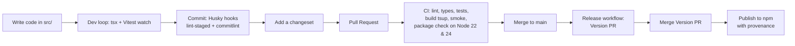
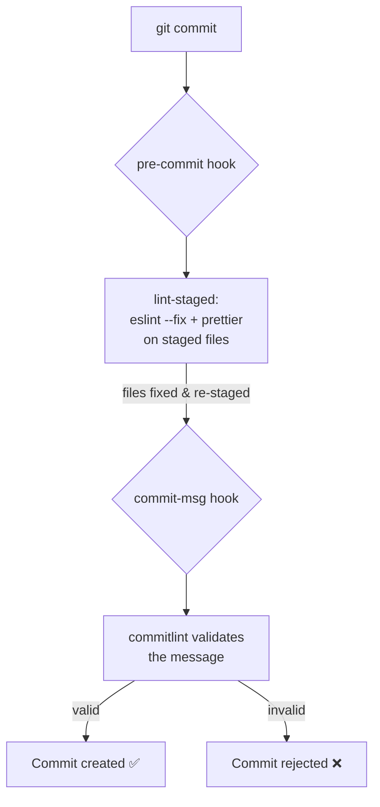
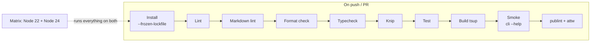
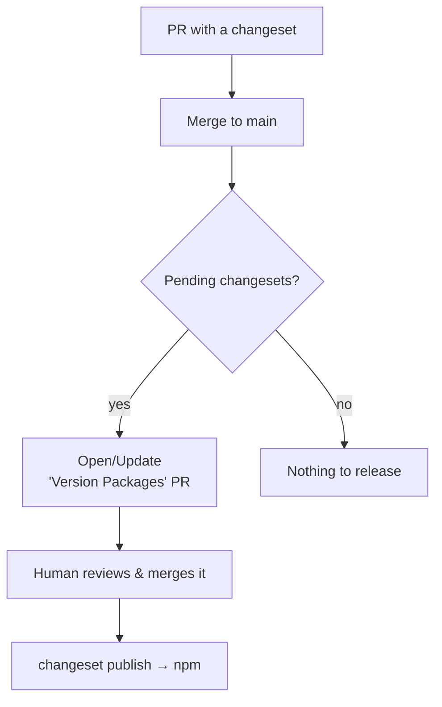

# Project Guide — Learn this TypeScript CLI + library setup from scratch

> A guided tour of **every tool, file, and decision** in this repository, written for a
> junior developer. For each piece you'll learn **what it is**, **what problem it
> solves**, **why we chose it** (and why not the alternatives), and you'll get a small
> **"Try it"** exercise so you learn by doing.

This is not API documentation. It's a learning document about _how a modern TypeScript
project that is **both a CLI and a library** is configured and why_.

---

## How to read this guide

Every section follows the same template:

- **What it is** — a plain-language definition.
- **Why we did it this way** — the reasoning behind the decision.
- **Alternatives (and why not)** — what else exists and the trade-offs.
- **Try it 🧪** — a hands-on exercise to cement the idea.
- **Learn more 📚** — official docs to go deeper.

Suggested learning path (each builds on the previous one):

1. [The big picture](#1-the-big-picture) — how everything connects.
2. [TypeScript & the compiler config](#2-typescript--the-compiler-config) ⭐ _must-know_
3. [Modules & ESM](#3-modules--esm) ⭐ _must-know_
4. [The package manager (pnpm)](#4-the-package-manager-pnpm)
5. [Building & running](#5-building--running)
6. [The CLI layer](#6-the-cli-layer) ⭐
7. [Code quality: ESLint, Prettier & markdownlint](#7-code-quality-eslint-prettier--markdownlint) ⭐
8. [Testing with Vitest](#8-testing-with-vitest) ⭐
9. [Git hygiene: hooks & commit conventions](#9-git-hygiene-hooks--commit-conventions)
10. [Continuous Integration (CI)](#10-continuous-integration-ci)
11. [Versioning & releases (Changesets)](#11-versioning--releases-changesets)
12. [Publish validation & packaging](#12-publish-validation--packaging)
13. [Dependency maintenance (Dependabot)](#13-dependency-maintenance-dependabot)
14. [Developer experience & environment](#14-developer-experience--environment)
15. [Repository meta files](#15-repository-meta-files)
16. [Glossary](#16-glossary)
17. [FAQ & common errors](#17-faq--common-errors)

> ⭐ = the concepts you should understand first; the rest you can absorb as you need them.

---

## 1. The big picture

This project has a **dual scope**: it is a **CLI** (a command you run in a terminal) **and**
a **library** (code other projects install and `import`). That single fact drives almost
every decision: we care about the **published output**, **type safety**, a smooth **CLI
user experience**, and a smooth **contributor workflow**.

Two entry points express the two faces of the project:

- [`src/cli.ts`](../src/cli.ts) — the **binary**: parses arguments, runs commands, handles
  errors and exit codes. Declared in `package.json` under `bin`.
- [`src/index.ts`](../src/index.ts) — the **public API**: what consumers get when they
  `import` the package. Declared under `exports`.

Both share the same **pure logic** in [`src/lib/`](../src/lib/), so a feature works
identically whether invoked from the terminal or from code.

Here's how a change travels from your editor to a published package:


```mermaid
flowchart LR
    A[Write code in src/] --> B[Dev loop: tsx + Vitest watch]
    B --> C[Commit: Husky hooks<br/>lint-staged + commitlint]
    C --> D[Add a changeset]
    D --> E[Pull Request]
    E --> F[CI: lint, types, tests,<br/>build tsup, smoke,<br/>package check on Node 22 & 24]
    F --> G[Merge to main]
    G --> H[Release workflow:<br/>Version PR]
    H --> I[Merge Version PR]
    I --> J[Publish to npm<br/>with provenance]
```

Each box maps to a section below. The rest of the guide explains the _tools_ inside
each box and _why_ they're configured the way they are.

**Try it 🧪** — Before reading further, open these files and just skim them; you'll
understand them by the end of this guide:
[`package.json`](../package.json), [`tsconfig.json`](../tsconfig.json),
[`tsup.config.ts`](../tsup.config.ts), [`eslint.config.ts`](../eslint.config.ts),
[`src/cli.ts`](../src/cli.ts).

---

## 2. TypeScript & the compiler config

### What it is

[TypeScript](https://www.typescriptlang.org/) is JavaScript with **static types**. You
write `.ts`, and the compiler (`tsc`) **checks types** (catches bugs before running). In
this project `tsc` is used **only for type-checking** — the actual JavaScript is emitted by
the bundler (see [Section 5](#5-building--running)).

The behavior of `tsc` is controlled by [`tsconfig.json`](../tsconfig.json). This project
uses a **single** `tsconfig.json`, and it's deliberately set to `noEmit: true`: the editor,
`pnpm typecheck`, and the type-aware linter all read it, but none of them produce output.
Building is the bundler's job.

### Why we did it this way

- **One tsconfig, no emit** keeps things simple: there's a single source of truth for
  strictness, and no chance of tests leaking into the build (the bundler decides what to
  emit, and it only bundles the real entry points).
- **`include: ["src", "*.ts"]`** covers not just your source but also the root config files
  (`tsup.config.ts`, `vitest.config.ts`, `eslint.config.ts`), so the type-aware linter can
  check them too.

The config turns on a lot of strictness on purpose. The important flags:

| Flag                                    | What it does                                                                              | Why                                                                   |
| --------------------------------------- | ----------------------------------------------------------------------------------------- | --------------------------------------------------------------------- |
| `strict`                                | Enables all the core strict checks (e.g. `strictNullChecks`).                             | The single most valuable setting in TS. Non-negotiable.               |
| `noUncheckedIndexedAccess`              | `arr[i]` is typed as `T \| undefined`.                                                    | Forces you to handle the "what if it's missing?" case.                |
| `exactOptionalPropertyTypes`            | `{ x?: number }` is not the same as `{ x: number \| undefined }`.                         | Models optional-vs-undefined precisely; avoids subtle bugs.           |
| `verbatimModuleSyntax`                  | Imports/exports are emitted exactly as written; type-only imports must say `import type`. | Predictable ESM output, no accidental runtime imports of types.       |
| `isolatedModules`                       | Each file must be compilable alone.                                                       | Compatibility with single-file transpilers (esbuild/swc/Vitest/tsup). |
| `noUnusedLocals` / `noUnusedParameters` | Errors on dead variables.                                                                 | Keeps code clean; catches mistakes.                                   |
| `resolveJsonModule`                     | Allows `import pkg from '../package.json'`.                                               | The CLI reads its own name/version/description from `package.json`.   |
| `moduleDetection: force`                | Every file is treated as a module.                                                        | No accidental global scripts.                                         |
| `module: nodenext` / `target: es2024`   | Modern Node module resolution; compile down to ES2024.                                    | Matches the Node `>=22` we support; see notes below.                  |

A note on **`target: es2024`** (not `esnext`): `esnext` is a _moving target_ — its
meaning changes as TypeScript updates. Pinning to a concrete year (`es2024`) makes the
type-check reproducible. We picked `es2024` because it's safely supported by Node 22+.

A note on **`ignoreDeprecations: "6.0"`**: the bundler's type-definition (`.d.ts`) generator
internally sets `baseUrl`, an option TypeScript is deprecating for the 7.0 release. This flag
silences that forward-looking deprecation so the build works on the current toolchain; it can
be removed once the bundler stops relying on `baseUrl`.

### Full `tsconfig.json` reference

Every option in [`tsconfig.json`](../tsconfig.json), in plain language:

#### Modules & language version

- `module: "nodenext"` — use Node's modern module system (ESM with `import`).
- `target: "es2024"` — which JavaScript version your code is checked against.
- `lib: ["es2024"]` — which language APIs you're allowed to use.
- `types: ["node"]` — load Node's types (`process`, `fs`, …).
- `resolveJsonModule: true` — allow `import data from './x.json'`.

#### Safety & strictness

- `forceConsistentCasingInFileNames: true` — `./File` and `./file` can't be mixed (matters on Linux).
- `noUncheckedIndexedAccess: true` — `arr[i]` is typed `T | undefined`, forcing you to handle the missing case.
- `exactOptionalPropertyTypes: true` — distinguishes "property absent" from "property = undefined".
- `noImplicitReturns: true` — every code path in a function must return (or none).
- `noImplicitOverride: true` — overriding a parent method requires the `override` keyword.
- `noUnusedLocals: true` — error on declared-but-unused variables.
- `noUnusedParameters: true` — error on unused parameters.
- `noFallthroughCasesInSwitch: true` — prevents forgetting `break` in a `switch`.
- `strict: true` — enables the full bundle of strict checks (the single most important one).

#### Modern modules

- `verbatimModuleSyntax: true` — emit imports exactly as written; type-only imports must use `import type`.
- `isolatedModules: true` — each file must be compilable on its own (compatible with esbuild/Vitest/tsup).
- `noUncheckedSideEffectImports: true` — warn if you side-effect-import a module that doesn't exist.
- `moduleDetection: "force"` — treat every file as a module (no accidental global scripts).

#### Performance & emit

- `skipLibCheck: true` — don't type-check the internals of third-party `.d.ts` files (faster builds).
- `ignoreDeprecations: "6.0"` — silence the forward-looking `baseUrl` deprecation (see above).
- `noEmit: true` — `tsc` never writes files; it only checks. The bundler emits the output.

#### Scope

- `include: ["src", "*.ts"]` — which files are type-checked (source + root config files).
- `exclude: ["node_modules", "dist"]` — which folders are ignored.

### Alternatives (and why not)

- **Plain `tsc` for the build (no bundler)** — great for a _pure_ ESM library: zero extra
  dependencies, and `tsc` emits accurate `.d.ts`. But this project ships a **CLI**, which
  needs a preserved shebang, an executable bit, and ideally its `package.json` metadata
  inlined — all of which a bundler does for you (see [Section 5](#5-building--running)). So
  we let a bundler build and keep `tsc` for checking only.
- **Babel for compilation** — Babel strips types but cannot _check_ them. You'd still need
  `tsc` for types, so it adds a tool without removing one.
- **Multiple tsconfig files** (a separate build/lint config) — a common pattern, but once
  the bundler owns emit, a single `noEmit` config covers the editor, the linter, and
  `typecheck` with less to keep in sync.

### Try it 🧪

1. In [`src/lib/greet.ts`](../src/lib/greet.ts), add `const unused = 1;` and run
   `pnpm typecheck`. Watch `noUnusedLocals` reject it.
2. Change `target` to `"es5"` in [`tsconfig.json`](../tsconfig.json) and run `pnpm typecheck`
   — nothing emits (it's `noEmit`), but you'll see the language-level checks shift. Revert.

### Learn more 📚

- [TSConfig reference](https://www.typescriptlang.org/tsconfig)
- [The TSConfig "Cheat Sheet"](https://www.totaltypescript.com/tsconfig-cheat-sheet)

---

## 3. Modules & ESM

### What it is

JavaScript has two module systems: the old **CommonJS** (`require`/`module.exports`) and
the modern standard **ES Modules / ESM** (`import`/`export`). This project is
**ESM-only**, declared by `"type": "module"` in [`package.json`](../package.json).

Two `package.json` fields declare the two entry points:

```jsonc
"bin": {
  "typescript-library-seed": "./dist/cli.js"  // the CLI binary
},
"main": "./dist/index.js",                     // legacy library fallback
"types": "./dist/index.d.ts",                  // legacy types fallback
"exports": {
  ".": {
    "types": "./dist/index.d.ts",              // what TypeScript reads
    "default": "./dist/index.js"               // what the runtime imports
  },
  "./package.json": "./package.json"           // let tools read our package.json
}
```

### Why we did it this way

- **ESM-only** is where the ecosystem is heading; it's simpler to ship one format
  correctly than to ship two and validate both. Node 22+ supports ESM natively.
- **`bin` vs `exports`** — `bin` maps a command name to the CLI entry; `exports` declares
  the importable API. They point at different files (`cli.js` vs `index.js`) so the two
  faces of the package stay cleanly separated.
- The **`exports` field** is the modern, strict way to declare your public API. Unlike the
  old `main`, it _prevents_ consumers from importing internal files you didn't intend to
  expose ("encapsulation"). We keep `main`/`types` too as a fallback for old tooling.
- **Order matters** inside an export condition: `types` must come first so TypeScript
  resolves it before the runtime `default`.
- **`"sideEffects": ["./dist/cli.js"]`** — a precise list, not a blanket `false`. It tells
  bundlers "importing this package has no side effects **except** the CLI entry." The CLI
  file _does_ have side effects (it parses `argv` and runs on load), so it's listed; the
  library code stays side-effect-free, which enables **tree-shaking** (dead-code
  elimination) in consumer apps.

A subtle but important rule you'll hit: **in ESM, relative imports need the file
extension, and it's `.js` even from a `.ts` file**. Look at
[`src/index.ts`](../src/index.ts): it re-exports `from './lib/greet.js'`, not
`'./lib/greet'` or `'./lib/greet.ts'`. That's because the import path refers to the
_compiled output_, and ESM requires explicit extensions. `verbatimModuleSyntax` enforces
this.

### Alternatives (and why not)

- **CommonJS-only** — maximally compatible with old code, but it's the legacy format;
  new projects shouldn't start there.
- **Dual ESM + CJS** — broadest compatibility, but it doubles the build complexity and is
  a famous source of the "dual package hazard" (two copies of your module loaded at once).
  Only worth it if you must support CJS-only consumers.

### Try it 🧪

After `pnpm build`, open `dist/index.js` and confirm it uses `export` (proving it's ESM).
Then change the re-export in [`src/index.ts`](../src/index.ts) to `'./lib/greet'` (no
extension) and run `pnpm test:run` — watch it fail to resolve.

### Learn more 📚

- [Node.js: package `exports`](https://nodejs.org/api/packages.html#exports)
- [Node.js: package `bin`](https://docs.npmjs.com/cli/v10/configuring-npm/package-json#bin)
- ["Pure ESM package" guide](https://gist.github.com/sindresorhus/a39789f98801d908bbc7ff3ecc99d99c)

---

## 4. The package manager (pnpm)

### What it is

[pnpm](https://pnpm.io/) installs your dependencies. It's an alternative to `npm` and
`yarn`. The project pins it with `"packageManager": "pnpm@11.6.0"` in
[`package.json`](../package.json), which **Corepack** (built into Node) reads to use the
exact right version automatically.

### Why we did it this way

- **Speed & disk efficiency** — pnpm stores one global copy of each package version and
  hard-links it into projects, so installs are fast and take far less disk.
- **Strictness** — pnpm's `node_modules` layout prevents "phantom dependencies" (using a
  package you never declared). This catches bugs that npm would hide.
- **`packageManager` + Corepack** — guarantees everyone (and CI) uses the _same_ pnpm
  version, so "works on my machine" problems disappear.
- **`pnpm-lock.yaml`** — the lockfile pins the exact resolved versions of every
  dependency. CI installs with `--frozen-lockfile` so it fails if the lockfile is out of
  date rather than silently changing versions.
- [`pnpm-workspace.yaml`](../pnpm-workspace.yaml) — here it contains
  `allowBuilds: { esbuild: true }`. Since pnpm 10, dependency build scripts are **blocked
  by default** for security. `esbuild` ships a native binary via its install script, and
  it's pulled in by `tsx`, Vitest, knip **and the bundler (`tsup`)**, so we explicitly allow
  it to build.

### Alternatives (and why not)

- **npm** — ships with Node, zero setup, but slower and looser (allows phantom deps).
- **yarn** — fine, but pnpm has become the community favorite thanks to its strictness and
  efficiency.
- **Bun** — very fast and promising, but newer; pnpm is the safer, more universally
  supported default today.

### Try it 🧪

Run `pnpm why esbuild` to see who pulls it in (`tsx`, `vitest`, `tsup`…). Then run
`pnpm install --frozen-lockfile` and notice it does nothing because the lockfile already
matches — that's what CI relies on.

### Learn more 📚

- [pnpm docs](https://pnpm.io/motivation)
- [Corepack](https://nodejs.org/api/corepack.html)

---

## 5. Building & running

### What it is

The scripts that cover the things you do with the code: **run it while developing** and
**bundle it for shipping**.

- `pnpm dev` → `tsx src/cli.ts`: runs the CLI straight from TypeScript (pass args, e.g.
  `pnpm dev greet World`).
- `pnpm build` → `tsup`: bundles `src/` into `dist/` (both entry points).
- `pnpm start` → `node dist/cli.js`: runs the **built** CLI.
- `pnpm smoke` → `node dist/cli.js --help`: a quick check that the built binary boots.

The build is configured in [`tsup.config.ts`](../tsup.config.ts):

```ts
export default defineConfig({
  entry: ['src/index.ts', 'src/cli.ts'], // API + binary
  format: ['esm'],
  target: 'node22',
  dts: true, // emit .d.ts for the library API
  sourcemap: true,
  clean: true, // wipe dist/ before each build
  treeshake: true,
});
```

### Why we did it this way

- **[tsx](https://tsx.is/) for development** — it runs `.ts` files instantly with no
  build step, so your edit→run loop is fast. It uses esbuild under the hood, which
  transpiles (strips types) without type-checking — that's fine for running; the
  _checking_ is done separately by `pnpm typecheck`.
- **[tsup](https://tsup.egoist.dev/) for the build** — a thin wrapper over esbuild built for
  exactly this job. For a CLI it does three things `tsc` won't: it **preserves the shebang**
  (`#!/usr/bin/env node`) at the top of `cli.ts`, it **`chmod +x`** the output so the binary
  is executable, and it **inlines** the `package.json` import so the CLI knows its own
  version at runtime with no file read. It also emits the `.d.ts` for the library side
  (`dts: true`) and bundles both entries in one pass.
- **Dependencies stay external** — tsup does _not_ bundle your runtime dependencies
  (`commander`, `@clack/prompts`, `picocolors`) into the output; they're resolved from
  `node_modules` at run time. That's why they live in `dependencies`, not `devDependencies`.
- **`clean: true` replaces a `clean` script** — tsup wipes `dist/` itself before each build,
  so there's no need for a separate `rimraf` step.

A note on **source maps**: `sourcemap: true` produces `.js.map` files with the original
TypeScript **embedded** inside them, so consumers can debug into your source without you
shipping the `src/` folder. (Unlike plain `tsc`, tsup does **not** emit `.d.ts.map` files, so
"Go to Definition" lands on the `.d.ts` rather than the original `.ts` — a small trade-off
for the CLI conveniences above.)

### Alternatives (and why not)

- **Plain `tsc`** — simplest for a pure library and emits `.d.ts.map`, but it won't handle
  the shebang/executable-bit/metadata-inlining a CLI wants. See [Section 2](#2-typescript--the-compiler-config).
- **Rollup / plain esbuild** — more control, but more configuration; `tsup` gives the
  common "bundle a TS package (and CLI)" setup out of the box.
- **`node --experimental-strip-types`** for dev instead of `tsx` — Node can now run some TS
  directly, but it's still maturing; `tsx` is reliable today.

### Try it 🧪

Run `pnpm build`, then `head -1 dist/cli.js` (see the shebang survived) and
`ls -l dist/cli.js` (see the executable `x` bit). Now run `pnpm start greet World` and
`node dist/cli.js greet --json World`.

### Learn more 📚

- [tsup documentation](https://tsup.egoist.dev/)
- [tsx documentation](https://tsx.is/)

---

## 6. The CLI layer

### What it is

The part that turns the library into a terminal program. It's split into three layers so
each piece has one job and stays testable:

| File                                                | Layer       | Responsibility                                           |
| --------------------------------------------------- | ----------- | -------------------------------------------------------- |
| [`src/lib/greet.ts`](../src/lib/greet.ts)           | **logic**   | Pure functions. No I/O, no `process`, no printing.       |
| [`src/commands/greet.ts`](../src/commands/greet.ts) | **command** | Wires one subcommand: args, options, prompts, output.    |
| [`src/cli.ts`](../src/cli.ts)                       | **entry**   | Creates the program, registers commands, handles errors. |

Three small libraries do the heavy lifting:

- **[commander](https://github.com/tj/commander.js)** — parses arguments and subcommands,
  and generates `--help`.
- **[@clack/prompts](https://github.com/bombshell-dev/clack)** — pretty interactive prompts,
  used **only when there's a TTY**.
- **[picocolors](https://github.com/alexeyraspopov/picocolors)** — tiny terminal colors that
  **respect `NO_COLOR`** automatically.

### Why we did it this way

The design follows [clig.dev](https://clig.dev/), the community guidelines for
human-friendly CLIs. The concrete rules you can see in [`src/commands/greet.ts`](../src/commands/greet.ts):

- **Don't prompt when there's no TTY.** If `name` is missing _and_ output isn't a terminal
  (a script, a pipe, CI), the command throws instead of hanging on an interactive prompt.
  It only asks with `@clack/prompts` when `process.stdout.isTTY` is true.
- **Support `--json` for scripting.** Humans get a colored line; machines get
  `{"message":"..."}` they can parse. A CLI that's scriptable is far more useful.
- **Respect `NO_COLOR`.** `picocolors` disables colors automatically when the env var is set
  or output isn't a terminal — no manual checks needed.
- **Correct exit codes.** Success is `0`; a user cancelling a prompt (Ctrl-C) sets `130`
  (the SIGINT convention); any error sets `1`.

And in [`src/cli.ts`](../src/cli.ts):

- **`process.exitCode` instead of `process.exit()`.** Setting `exitCode` lets Node finish
  flushing `stdout`/`stderr` before it quits; `process.exit()` can cut off buffered output.
- **The CLI reads its own metadata** (`name`, `version`, `description`) from `package.json`,
  so `--version` and `--help` never drift from the manifest.
- **Errors are caught once, centrally** — the top-level `try/catch` prints the message to
  `stderr` and sets exit code `1`, so individual commands can just `throw`.

Because the logic lives in `lib/`, the exact same `greet` powers both the CLI and the
imported API — no duplication.

### Alternatives (and why not)

- **Parsing `process.argv` by hand** — fine for one flag, but you'd reinvent help text,
  subcommands, and validation. commander is the mature default; `yargs` is a heavier
  alternative.
- **Prompting libraries** — `inquirer` and `prompts` are popular; `@clack/prompts` is the
  modern, lighter choice with a nicer default look.
- **Full color libraries** (`chalk`) — great, but `picocolors` is a fraction of the size and
  covers everything this CLI needs.

### Try it 🧪

1. `pnpm dev greet World` (a name is given → prints directly).
2. `pnpm dev greet` **in your terminal** (no name, TTY → it prompts you).
3. `echo | pnpm dev greet` (no name, no TTY → it errors instead of hanging). Check the exit
   code with `echo $?` — it's `1`.
4. `pnpm dev greet World --json` — machine-readable output.

### Learn more 📚

- [Command Line Interface Guidelines (clig.dev)](https://clig.dev/)
- [commander.js](https://github.com/tj/commander.js)

---

## 7. Code quality: ESLint, Prettier & markdownlint

### What it is

- **[ESLint](https://eslint.org/)** finds _problems_ (bugs, risky patterns). Configured
  in [`eslint.config.ts`](../eslint.config.ts).
- **[Prettier](https://prettier.io/)** enforces _formatting_ (spacing, quotes, line
  width). Configured in [`.prettierrc`](../.prettierrc).
- **[markdownlint](https://github.com/DavidAnson/markdownlint)** (via
  [`markdownlint-cli2`](https://github.com/DavidAnson/markdownlint-cli2)) lints the
  _Markdown_ docs for structural issues Prettier doesn't catch. Configured in
  [`.markdownlint.jsonc`](../.markdownlint.jsonc); run with `pnpm lint:md`.

They do different jobs and are used together: **ESLint for code correctness, Prettier for
style, markdownlint for documentation quality.**

### Why we did it this way

- **Flat config (`eslint.config.ts`)** — ESLint's modern configuration format (the old
  `.eslintrc` is deprecated). Writing it in TypeScript gives autocomplete and type safety
  on the config itself.
- **Type-aware linting** — we enable
  [`typescript-eslint`](https://typescript-eslint.io/)'s `strictTypeChecked` and
  `stylisticTypeChecked` rule sets, plus the **`unicorn`** (modern best practices) and
  **`sonarjs`** (code-smell/bug detection) plugins. Type-aware rules use _type information_
  to catch deep bugs (floating promises, unsafe `any`) that text-only linters miss. The
  `projectService` setting wires ESLint to the TypeScript program so it knows the types.
- **`eslint-config-prettier` is listed last** — it _turns off_ all ESLint rules that
  would fight with Prettier, so the two tools never disagree about formatting. Order
  matters: it must come last to win.
- **A small test override** — test files relax a couple of `no-unsafe-*` rules (see the
  bottom of [`eslint.config.ts`](../eslint.config.ts)), because assertions often poke at
  loosely-typed values on purpose. The CLI layer, notably, needs **no** special override:
  it uses `process.stdout.write` and `process.exitCode` (not `console` or `process.exit`),
  so it passes the default rules cleanly.
- **Prettier settings** ([`.prettierrc`](../.prettierrc)) are mostly defaults plus a few
  conventions: single quotes, trailing commas everywhere (cleaner diffs), 80-column width,
  LF line endings.
- **markdownlint complements Prettier on docs** — it enforces _structure_ (heading
  increments, list consistency, fenced-code languages, bare URLs…) that Prettier doesn't. It
  runs in CI and auto-fixes staged files via lint-staged, _before_ Prettier so they don't
  fight over the result.

### Alternatives (and why not)

- **Biome** — an all-in-one, very fast linter+formatter (Rust). Compelling, but the ESLint +
  Prettier + `typescript-eslint` combination still has the deepest type-aware rules and the
  largest ecosystem. A reasonable future swap.
- **ESLint's own formatting rules** — deprecated; the standard is "let Prettier format, let
  ESLint lint."

### Try it 🧪

1. In [`src/lib/greet.ts`](../src/lib/greet.ts), mangle the spacing (e.g.
   `export  const  greet`) and run `pnpm format` — Prettier fixes it.
2. Write `const x: any = 1;` and run `pnpm lint` — `strictTypeChecked` will warn about the
   unsafe `any`.

### Finding dead code & unused deps (knip)

[Knip](https://knip.dev/) scans the project and reports **unused files, exports, and
dependencies** — the clutter that accumulates as a codebase grows. It runs with `pnpm knip`
and is wired into CI (Section 10), so dead code can't quietly pile up.

- **Why** — an unused export is API you're accidentally committing to; an unused dependency
  is install weight and extra attack surface. Knip catches both before review does.
- **Config** ([`knip.json`](../knip.json)) is intentionally minimal: knip infers the entry
  points from `package.json` — both the `exports` (the library API) **and the `bin`** (the
  CLI). Because `bin` points at the built `cli.js`, knip maps it back to `src/cli.ts` and
  correctly sees the whole CLI layer as "used," so nothing here needs hand-maintaining.

**Try it 🧪** — add `export const unused = 1;` to [`src/lib/greet.ts`](../src/lib/greet.ts)
without importing it anywhere and run `pnpm knip`; watch it flag the unused export, then
remove it.

### Learn more 📚

- [typescript-eslint: shared configs](https://typescript-eslint.io/users/configs)
- [Why Prettier + ESLint](https://prettier.io/docs/en/integrating-with-linters.html)
- [Knip documentation](https://knip.dev/)

---

## 8. Testing with Vitest

### What it is

[Vitest](https://vitest.dev/) is the test runner. Configuration lives in
[`vitest.config.ts`](../vitest.config.ts). There are two kinds of tests:

- **Unit tests** for the pure logic — [`src/lib/greet.test.ts`](../src/lib/greet.test.ts).
- **End-to-end (e2e) test** for the wired CLI — [`src/cli.test.ts`](../src/cli.test.ts),
  which actually **runs the CLI in a subprocess** with [`execa`](https://github.com/sindresorhus/execa)
  and asserts on its output and exit code.

### Why we did it this way

- **Vitest over Jest** — Vitest is fast, ESM-native, and uses the same config style as
  Vite. It works out-of-the-box with TypeScript and ESM, which Jest only does with extra
  configuration.
- **Colocated tests** — tests live _next to_ the code they test (`greet.ts` ↔
  `greet.test.ts`) instead of a separate `tests/` folder. The build never ships them because
  the bundler only emits the declared entry points, and coverage excludes `*.test.ts`.
- **Explicit imports (no `globals`)** — tests `import { describe, it, expect } from 'vitest'`
  rather than relying on Jest-style globals. It gives better type inference and keeps each
  file self-describing. Flip `globals: true` in [`vitest.config.ts`](../vitest.config.ts) if
  you prefer the implicit style.
- **Test the logic in-process, the CLI end-to-end** — pure functions are tested directly
  (fast, exact). The CLI is tested by spawning the real command, which is the honest way to
  verify argument parsing, `--json`, and exit codes actually work when wired together.
- **v8 coverage with 80% thresholds** — the config measures how much code your tests
  exercise and **fails** below 80%. One subtlety worth knowing: coverage only counts code
  loaded **in the test process**, so files exercised only via the e2e subprocess (`cli.ts`,
  `commands/`) don't contribute coverage numbers — which is exactly why the meaningful
  **logic** lives in `lib/` and is unit-tested directly. Thresholds turn coverage from a
  vanity number into an enforced quality gate on that logic.

### Alternatives (and why not)

- **Jest** — the long-time standard, huge ecosystem, but heavier ESM/TS setup.
- **node:test** (Node's built-in runner) — zero dependencies, but a thinner feature set
  and weaker watch/coverage DX than Vitest.
- **Testing the CLI only in-process** (importing and calling it) — faster, but it can't
  catch bugs in the actual process boundary (shebang, `argv`, exit codes). The e2e test is
  slower but real.

### Try it 🧪

1. Run `pnpm test` (watch mode). Edit `greet.test.ts` to expect the wrong value and watch it
   go red, then fix it.
2. Run `pnpm test:coverage`. Add an unused exported function to
   [`src/lib/greet.ts`](../src/lib/greet.ts) without a test and watch coverage drop below the
   threshold and fail the command.

### Learn more 📚

- [Vitest guide](https://vitest.dev/guide/)
- [Coverage configuration](https://vitest.dev/guide/coverage.html)

---

## 9. Git hygiene: hooks & commit conventions

### What it is

A set of tools that keep the Git history clean and catch problems _before_ they're
committed:

- **[Husky](https://typicode.github.io/husky/)** runs scripts on Git events (hooks). See
  [`.husky/`](../.husky/).
- **[lint-staged](https://github.com/lint-staged/lint-staged)** runs linters/formatters
  only on the files you're committing.
- **[commitlint](https://commitlint.js.org/)** validates commit _messages_.
- **[Commitizen](https://commitizen-tools.github.io/commitizen/)** (`pnpm commit`) gives
  you an interactive prompt to write a well-formed commit.

### Why we did it this way

- **`pre-commit` hook → lint-staged** ([.husky/pre-commit](../.husky/pre-commit)): before
  each commit, it auto-fixes ESLint issues and formats with Prettier — but **only on
  staged files**, so it's fast and never touches unrelated code.
- **`commit-msg` hook → commitlint** ([.husky/commit-msg](../.husky/commit-msg)):
  validates your message against **[Conventional Commits](https://www.conventionalcommits.org/)**
  (`feat:`, `fix:`, `chore:`…). This isn't bureaucracy — it's what lets **Changesets**
  and changelogs work automatically later.
- **Why enforce at commit time?** Catching issues locally is faster and cheaper than
  failing in CI. The hooks are a safety net, and CI is the backstop.

### How it's wired

The whole chain is set up from four places:

1. **Installation (automatic).** `package.json` has `"prepare": "husky"`. pnpm runs the
   `prepare` script after every `pnpm install`, which activates Husky by pointing Git's
   hooks at the `.husky/` directory. No manual setup needed.

2. **The hook files** in [`.husky/`](../.husky/) — each is a tiny script Git runs on an
   event:

   ```sh
   # .husky/pre-commit
   pnpm exec lint-staged

   # .husky/commit-msg
   pnpm exec commitlint --edit $1   # $1 is the file holding your commit message
   ```

3. **What lint-staged runs** (configured in [`package.json`](../package.json)) — only on
   the files you staged:

   ```jsonc
   "lint-staged": {
     "*.{ts,tsx}": ["eslint --fix", "prettier --write"],
     "*.md": ["markdownlint-cli2 --fix", "prettier --write"],
     "*.json": ["prettier --write"]
   }
   ```

4. **What commitlint validates** ([`commitlint.config.ts`](../commitlint.config.ts)) — it
   extends the Conventional Commits ruleset:

   ```ts
   export default { extends: ['@commitlint/config-conventional'] };
   ```

So a `git commit` with a non-conventional type (e.g. `"fix stuff"`) is rejected, while
`feat: add X` passes. Run `pnpm commit` (Commitizen) for a guided prompt.

### How a commit flows


```mermaid
flowchart TD
    A[git commit] --> B{pre-commit hook}
    B --> C[lint-staged:<br/>eslint --fix + prettier<br/>on staged files]
    C -->|files fixed & re-staged| D{commit-msg hook}
    D --> E[commitlint validates<br/>the message]
    E -->|valid| F[Commit created ✅]
    E -->|invalid| G[Commit rejected ❌]
```

### Alternatives (and why not)

- **No hooks** — simpler, but quality problems slip into history and only surface in CI
  (or never). For a shared/published project, the small friction is worth it.
- **Other hook managers** (simple-git-hooks, lefthook) — fine choices; Husky is the most
  widely used and well-documented.

### Try it 🧪

Run `git commit -m "broke the rules"` (no Conventional Commit prefix) — commitlint
rejects it. Then try `pnpm commit` for the guided experience, or
`git commit -m "docs: try the guide"`.

### Learn more 📚

- [Conventional Commits spec](https://www.conventionalcommits.org/)
- [Husky get started](https://typicode.github.io/husky/get-started.html)

---

## 10. Continuous Integration (CI)

### What it is

[GitHub Actions](https://docs.github.com/actions) automatically runs checks on every push
and pull request. The workflow is [`.github/workflows/ci.yml`](../.github/workflows/ci.yml).

### Why we did it this way

The CI job runs the **same checks you run locally**, in order: lint → markdown lint →
format check → typecheck → knip → test → build → **smoke** → package validation. If it's
green, the change is safe to merge.

Key decisions:

- **Matrix on Node 22 and 24** — a published package must work on every Node version it
  claims to support (`engines: ">=22"`). The matrix runs the whole suite on both the LTS
  (22) and the current (24) versions to catch version-specific breakage.
- **A `smoke` step after build** — building the CLI isn't enough; CI also runs
  `node dist/cli.js --help` (`pnpm smoke`) to prove the **built binary actually boots**.
  This catches packaging bugs (bad shebang, broken entry, missing dependency) that a passing
  build alone would miss.
- **`fail-fast: false`** — if one Node version fails, the others keep running so you see
  _every_ version's result in one go.
- **`concurrency` with `cancel-in-progress: true`** — if you push twice quickly, the older
  run is cancelled so CI isn't wasting time on outdated code.
- **`cache: pnpm`** — caches the dependency store between runs so installs are fast.
- **`--frozen-lockfile`** — CI fails if `pnpm-lock.yaml` doesn't match `package.json`,
  preventing accidental dependency drift.


```mermaid
flowchart LR
    subgraph "On push / PR"
    direction TB
    I[Install<br/>--frozen-lockfile] --> L[Lint]
    L --> MD[Markdown lint]
    MD --> F[Format check]
    F --> T[Typecheck]
    T --> K[Knip]
    K --> U[Test]
    U --> B[Build tsup]
    B --> S[Smoke<br/>cli --help]
    S --> P[publint + attw]
    end
    M[Matrix: Node 22 + Node 24] -.runs everything on both.-> I
```

### Security scanning (CodeQL)

A second workflow, [`.github/workflows/codeql.yml`](../.github/workflows/codeql.yml), runs
GitHub's [CodeQL](https://codeql.github.com/) static analysis. It scans the code for
security vulnerabilities on every push/PR to `main` and on a weekly schedule, publishing
findings to the repo's **Security** tab. It's kept separate from `ci.yml` because it has a
different cadence and needs the `security-events: write` permission to upload results.

As a supply-chain hardening step recommended by
[OpenSSF Scorecard](https://github.com/ossf/scorecard), **every action is pinned to a full
commit SHA** (with a `# v4`-style comment for readability) instead of a moving tag like
`@v4` — a moved tag could otherwise run code you never reviewed. Dependabot's
`github-actions` updates keep both the SHA and the comment current.

### Alternatives (and why not)

- **Other CI providers** (CircleCI, GitLab CI…) — all valid; GitHub Actions is the
  default when the code lives on GitHub (zero extra setup, tight integration).
- **A single Node version** — simpler, but you'd miss bugs that only appear on a version
  your users run.

### Try it 🧪

Open a branch, intentionally break the test, push, and open a PR. Watch the CI job go red
and block the merge. (Then fix it.)

### Learn more 📚

- [GitHub Actions: workflow syntax](https://docs.github.com/actions/using-workflows/workflow-syntax-for-github-actions)

---

## 11. Versioning & releases (Changesets)

### What it is

[Changesets](https://github.com/changesets/changesets) automates **versioning** and
**publishing**. You describe each change in a small file; the tooling figures out the new
version number, writes the changelog, and publishes. Configured in
[`.changeset/config.json`](../.changeset/config.json); automated by
[`.github/workflows/release.yml`](../.github/workflows/release.yml).

> **Note:** this seed is marked `"private": true`, so it never publishes itself. The release
> pipeline is wired up and ready; a project derived from the seed flips that switch. See
> [CONTRIBUTING.md](../CONTRIBUTING.md) for the one-time steps to enable publishing.

### Why we did it this way

- **Semantic Versioning (semver)** — versions are `MAJOR.MINOR.PATCH`. A `fix` bumps
  PATCH, a `feat` bumps MINOR, a breaking change bumps MAJOR. Consumers rely on this to
  upgrade safely.
- **You add a changeset, not a version** — when you make a change, you run
  `pnpm changeset` and pick the bump type. You **never edit the version by hand**, which
  avoids merge conflicts and human error.
- **Two-phase release** — the [release workflow](../.github/workflows/release.yml) doesn't
  publish immediately. First it opens a **"Version Packages" PR** that applies all pending
  changesets (bumping the version and updating `CHANGELOG.md`). Only when a human merges that
  PR does it actually **publish**. This gives you a review checkpoint before anything goes
  public.


```mermaid
flowchart TD
    A[PR with a changeset] --> B[Merge to main]
    B --> C{Pending changesets?}
    C -->|yes| D[Open/Update<br/>'Version Packages' PR]
    D --> E[Human reviews & merges it]
    E --> F[changeset publish → npm]
    C -->|no| G[Nothing to release]
```

- **npm provenance** (`publishConfig.provenance: true` in `package.json`, plus
  `id-token: write` in the workflow) — publishes a cryptographic record linking the package
  back to the exact CI run and commit, so consumers can verify it wasn't tampered with.

### How it's wired

Changesets lives in three places:

1. **The config** ([`.changeset/config.json`](../.changeset/config.json)) — the fields that
   matter for a single package:

   ```jsonc
   {
     "changelog": [
       "@changesets/changelog-github",
       { "repo": "rlopc/typescript_library_seed" },
     ],
     "commit": false, // don't auto-commit; you control it
     "access": "public", // publish publicly (when publishing is enabled)
     "baseBranch": "main",
   }
   ```

   We use **`@changesets/changelog-github`** so each changelog entry links back to its PR
   and author. It needs a `GITHUB_TOKEN` at version time, which the release workflow
   provides.

2. **The scripts** (in [`package.json`](../package.json)):

   ```jsonc
   "changeset": "changeset",
   "version-packages": "changeset version && pnpm install --lockfile-only",
   "release": "pnpm run build && changeset publish"
   ```

3. **The workflow** ([`.github/workflows/release.yml`](../.github/workflows/release.yml)) —
   runs on push to `main` and uses `changesets/action`, wiring the two phases together and
   granting `id-token: write` for provenance.

### Which bump do I pick?

When you run `pnpm changeset` it asks how the version should move:

| You did…                                            | Bump      | Example         |
| --------------------------------------------------- | --------- | --------------- |
| Fixed a bug; correct callers see no behavior change | **patch** | `1.2.3 → 1.2.4` |
| Added functionality without breaking existing usage | **minor** | `1.2.3 → 1.3.0` |
| Changed/removed public API; existing code may break | **major** | `1.2.3 → 2.0.0` |

For a CLI, "public API" means **both** the imported functions **and** the command surface:
renaming a command or removing a flag is a breaking change too.

- **Pre-1.0.0 caveat**: while the version is `0.x`, a breaking change conventionally bumps
  the **minor** (`0.2.0 → 0.3.0`), because `0.x` already signals an unstable API.

### Alternatives (and why not)

- **semantic-release** — fully automatic versioning from commit messages. Powerful, but
  gives less control and no human checkpoint before publish.
- **Manual `npm version` + `npm publish`** — simple for a one-off, but error-prone and
  doesn't generate changelogs.

### Try it 🧪

Run `pnpm changeset`, choose a `patch` bump, and write a summary. Look at the new file
created under [`.changeset/`](../.changeset/) — that's all a changeset is. (You can delete it
afterward if you don't want it.)

### Learn more 📚

- [Changesets: intro](https://github.com/changesets/changesets/blob/main/docs/intro-to-using-changesets.md)
- [Semantic Versioning](https://semver.org/)

---

## 12. Publish validation & packaging

### What it is

Two tools double-check that the package you're about to publish is correctly formed:

- **[publint](https://publint.dev/)** — lints your `package.json` for publishing mistakes.
- **[`@arethetypeswrong/cli`](https://arethetypeswrong.github.io/) (`attw`)** — verifies
  your types resolve correctly for every kind of consumer (ESM, CJS, bundler).

They run together via `pnpm check:publish`, and automatically before publishing through
the `prepublishOnly` script.

### Why we did it this way

- **A dual package is easy to get subtly wrong** — a bad `exports` path, a `bin` that points
  nowhere, missing types. These tools catch those mistakes _before_ your users do. We keep
  them even though this is also a CLI, precisely because the package **also** exposes a typed
  API that consumers `import`.
- **The `files` field** in [`package.json`](../package.json) controls exactly what ends up
  in the published tarball:

  ```jsonc
  "files": ["dist"]
  ```

  We ship only `dist` (the compiled CLI + library + types + maps), keeping the package
  small. The source maps embed the original TypeScript, so consumers can still debug into
  your code without you shipping a separate `src/` folder.

### Alternatives (and why not)

- **Not validating** — you'll eventually publish a broken package and find out from a bug
  report. The two checks cost seconds and prevent embarrassing releases.
- **Shipping `src` alongside `dist`** — an alternative way to keep maps resolvable, but it
  roughly doubles the tarball. Embedding sources in the maps gives the same debugging DX in a
  smaller package.

### Try it 🧪

Run `pnpm check:publish` and read the attw table — every row should be 🟢. Then run
`pnpm pack --dry-run` to see the exact list of files that would be published; confirm no
`*.test.ts` appears and that `dist/cli.js` is there.

### Learn more 📚

- [publint](https://publint.dev/)
- [Are the types wrong?](https://arethetypeswrong.github.io/)
- [npm: the `files` field](https://docs.npmjs.com/cli/v10/configuring-npm/package-json#files)

---

## 13. Dependency maintenance (Dependabot)

### What it is

[Dependabot](https://docs.github.com/code-security/dependabot) is a GitHub bot that opens
pull requests to update your dependencies. Configured in
[`.github/dependabot.yml`](../.github/dependabot.yml).

### Why we did it this way

- **Weekly schedule** for both npm packages and GitHub Actions versions — keeps everything
  current without daily noise.
- **Grouping** — minor and patch updates are bundled into a _single_ PR instead of one PR
  per package. **Major** updates come separately because they can contain breaking changes
  and deserve individual review.
- **Why bother?** Outdated dependencies are the #1 source of security vulnerabilities.
  Automated, reviewable updates keep you safe — and because CI runs on every Dependabot PR,
  you immediately see if an update breaks anything.

### Alternatives (and why not)

- **[Renovate](https://docs.renovatebot.com/)** — more configurable and powerful; Dependabot
  is the zero-setup default for GitHub.
- **Updating manually** — easy to forget, so things rot. Automation wins.

### Try it 🧪

Open [`.github/dependabot.yml`](../.github/dependabot.yml) and trace how the `groups` block
bundles `minor` + `patch`. Imagine how many PRs you'd get _without_ grouping.

### Learn more 📚

- [Dependabot configuration options](https://docs.github.com/code-security/dependabot/dependabot-version-updates/configuration-options-for-the-dependabot.yml-file)

---

## 14. Developer experience & environment

### What it is

A collection of small files that make sure **everyone works in the same environment**:

| File                                    | Role                                                                            |
| --------------------------------------- | ------------------------------------------------------------------------------- |
| [`.nvmrc`](../.nvmrc)                   | Pins the Node version for tools like `nvm`/`fnm` and for CI.                    |
| [`.editorconfig`](../.editorconfig)     | Basic editor settings (indentation, charset, final newline) every IDE respects. |
| [`.devcontainer/`](../.devcontainer/)   | A ready-made Docker dev environment (VS Code / GitHub Codespaces).              |
| [`.vscode/`](../.vscode/)               | Shared editor settings + recommended extensions.                                |
| [`.gitignore`](../.gitignore)           | Files Git should never track (`node_modules`, `dist`, `.env`…).                 |
| [`.gitattributes`](../.gitattributes)   | Normalizes line endings to LF; marks the lockfile as generated.                 |
| [`.prettierignore`](../.prettierignore) | Paths Prettier shouldn't format.                                                |

### Why we did it this way

- **`.nvmrc` vs `engines`** — `engines: ">=22"` in `package.json` is the _minimum_ version
  the project supports (a promise to consumers); `.nvmrc` is the _exact_ version
  contributors and CI should develop with. Different jobs, both useful.
- **Dev container** — clone the repo, "Reopen in Container," and you have the exact Node +
  pnpm + extensions with no manual setup. It eliminates "works on my machine" entirely.
- **`.vscode/settings.json`** turns on format-on-save and ESLint auto-fix, and points the
  editor at the workspace TypeScript version — so the editor behaves identically to CI.
- **`.editorconfig`** is the lowest-common-denominator that works even in editors without
  Prettier installed.
- **`.gitattributes` + LF** — guarantees the same line endings on every OS, avoiding noisy
  "the whole file changed" diffs.

### Keep `.editorconfig` and `.prettierrc` in sync

`.editorconfig` and [`.prettierrc`](../.prettierrc) overlap on two settings, and they
**must agree** or the editor and Prettier will fight each other:

| Setting      | `.editorconfig`    | `.prettierrc`     |
| ------------ | ------------------ | ----------------- |
| Indent width | `indent_size = 2`  | `tabWidth: 2`     |
| Line endings | `end_of_line = lf` | `endOfLine: "lf"` |

### Alternatives (and why not)

- **No dev container** — fine for experienced devs, but raises the onboarding bar. It's
  optional: you can ignore it and just `pnpm install`.
- **No `.editorconfig`** — works, but `.editorconfig` covers editors and file types Prettier
  doesn't.

### Try it 🧪

If you have Docker and VS Code, run "Dev Containers: Reopen in Container" and watch it
build a fully configured environment. Otherwise, open
[`.vscode/settings.json`](../.vscode/settings.json) and see how format-on-save is enabled.

### Learn more 📚

- [Dev Containers](https://containers.dev/)
- [EditorConfig](https://editorconfig.org/)

---

## 15. Repository meta files

### What it is

The "paperwork" that makes a repository welcoming, safe, and professional:

| File                                                                      | Purpose                                                        |
| ------------------------------------------------------------------------- | -------------------------------------------------------------- |
| [`README.md`](../README.md)                                               | The front page: what the project is, how to run and import it. |
| [`CONTRIBUTING.md`](../CONTRIBUTING.md)                                   | How to contribute: setup, workflow, releases.                  |
| [`CODE_OF_CONDUCT.md`](../CODE_OF_CONDUCT.md)                             | Expected behavior in the community.                            |
| [`SECURITY.md`](../SECURITY.md)                                           | How to report vulnerabilities privately.                       |
| [`LICENSE`](../LICENSE)                                                   | The legal terms (MIT — permissive, business-friendly).         |
| [`.github/ISSUE_TEMPLATE/`](../.github/ISSUE_TEMPLATE/)                   | Structured forms for bug reports / feature requests.           |
| [`.github/PULL_REQUEST_TEMPLATE.md`](../.github/PULL_REQUEST_TEMPLATE.md) | A checklist contributors fill in for each PR.                  |

### Why we did it this way

- **README is for _users_**, CONTRIBUTING is for _contributors_ — splitting them keeps each
  focused.
- **Issue/PR templates** make reports consistent and remind contributors of the steps (add a
  changeset, run the checks) — fewer back-and-forth round trips.
- **SECURITY.md** routes vulnerability reports to a _private_ channel instead of a public
  issue, so problems can be fixed before they're disclosed.
- **MIT license** — the most permissive common license; maximizes who can use the project.

GitHub automatically discovers these files by their **path and name** under
[`.github/`](../.github/) — no configuration links them; the location _is_ the contract.
The PR template mirrors the exact gates CI enforces (Section 10), so a contributor
self-checks _before_ CI runs. Issues use GitHub's **Issue Forms** (structured YAML), and
[`config.yml`](../.github/ISSUE_TEMPLATE/config.yml) sets `blank_issues_enabled: false` to
force everyone through the forms.

### Alternatives (and why not)

- **No meta files** — fine for a private throwaway, but any shared or open-source project
  benefits enormously; they're the difference between "a pile of code" and "a project people
  can join."
- **A stricter license (GPL)** — appropriate for some projects, but more restrictive for
  consumers; MIT is the default for code meant to be widely adopted.

### Try it 🧪

Read [`CONTRIBUTING.md`](../CONTRIBUTING.md) end to end — it's the practical summary of
everything in this guide, written for someone about to make their first contribution.

---

## 16. Glossary

- **Transpile / compile** — translate TypeScript into JavaScript. Transpiling just strips
  types; a full compile also _checks_ types.
- **Bundler** — a tool (here, `tsup`) that turns your source into the shippable output,
  handling formats, source maps, and — for a CLI — the shebang and executable bit.
- **Type-check** — verify the code is type-correct _without_ producing output (`tsc --noEmit`).
- **ESM / CommonJS** — the modern (`import`/`export`) vs legacy (`require`) module systems.
- **`.d.ts` (declaration file)** — types-only file that tells consumers the shape of your
  API without shipping implementation.
- **Source map** — a `.map` file linking compiled output back to the original source, so
  debuggers can find the real code.
- **Tree-shaking** — a bundler removing code you don't import. Enabled by a precise
  `sideEffects` list.
- **Shebang** — the `#!/usr/bin/env node` first line that lets the OS run a script as a
  program.
- **TTY** — an interactive terminal. CLIs prompt only when attached to one.
- **Exit code** — the number a process returns; `0` = success, non-zero = failure (`130` =
  interrupted).
- **Flat config** — ESLint's modern array-based configuration format (`eslint.config.*`).
- **Lockfile** — a file pinning exact dependency versions for reproducible installs
  (`pnpm-lock.yaml`).
- **Phantom dependency** — using a package you didn't declare but that happens to be
  installed; pnpm prevents this.
- **Conventional Commits** — a commit-message convention (`feat:`, `fix:`…) that machines
  can parse.
- **Semver** — Semantic Versioning, `MAJOR.MINOR.PATCH`.
- **Changeset** — a small file describing a change and its version bump.
- **Provenance** — a verifiable record of where/how a package was built, for supply-chain
  security.

---

## 17. FAQ & common errors

**Q: Why are there two entry points (`cli.ts` and `index.ts`)?**
Because the project is dual: `cli.ts` is the terminal command (via `bin`), `index.ts` is the
importable API (via `exports`). Both reuse the same pure logic in `src/lib/`.

**Q: Why do imports end in `.js` when the file is `.ts`?**
Because the path refers to the _compiled_ output, and ESM requires explicit file
extensions. `verbatimModuleSyntax` enforces it.

**Q: Why does the CLI test spawn a subprocess instead of importing the CLI?**
To test it the way a user runs it — real `argv`, real exit codes. The trade-off is that this
code doesn't count toward coverage (coverage only sees the test process), which is fine
because the meaningful logic lives in `src/lib/` and is unit-tested directly.

**Q: My commit was rejected — "subject may not be empty / type may not be empty".**
Your message isn't a Conventional Commit. Use a prefix: `feat: …`, `fix: …`, `docs: …`,
`chore: …`. Or run `pnpm commit`.

**Q: `pnpm install` says the lockfile is out of date / `--frozen-lockfile` failed in CI.**
You changed `package.json` dependencies without updating `pnpm-lock.yaml`. Run
`pnpm install` locally to refresh the lockfile and commit it.

**Q: Do I bump the version number in `package.json` myself?**
No — never. Add a changeset (`pnpm changeset`) and the release workflow handles the
version and changelog.

**Q: Why is the package `"private": true`? How do I publish?**
The seed is intentionally unpublishable so nobody ships the template by accident. A derived
project removes `"private": true` and configures a registry — see
[CONTRIBUTING.md](../CONTRIBUTING.md).

**Q: What's `ignoreDeprecations: "6.0"` doing in the tsconfig?**
It silences a forward-looking TypeScript deprecation (`baseUrl`) that the bundler's `.d.ts`
generator triggers. It's a temporary compatibility shim; see [Section 2](#2-typescript--the-compiler-config).

**Q: ESLint is slow.**
Type-aware linting builds a TypeScript program, which costs time but finds far more bugs.
For a small project it's negligible.

---

## Worked example: a change from start to finish

The whole workflow on one page. Say you're adding a `farewell` feature, exposed both as a
library function and reused by a command.

**1. Branch off `main`.**

```bash
git switch -c feat/farewell
```

**2. Write the pure logic and a colocated unit test.** In
[`src/lib/farewell.ts`](../src/lib/):

```ts
export const farewell = (name: string): string => `Goodbye, ${name}!`;
```

In `src/lib/farewell.test.ts`:

```ts
import { describe, it, expect } from 'vitest';
import { farewell } from './farewell.js'; // .js, not .ts — see Section 3

describe('farewell', () => {
  it('says goodbye', () => {
    expect(farewell('World')).toBe('Goodbye, World!');
  });
});
```

**3. Expose it in the public API** — add to [`src/index.ts`](../src/index.ts):

```ts
export { farewell } from './lib/farewell.js';
```

(To also add a `farewell` **command**, create `src/commands/farewell.ts` mirroring
[`src/commands/greet.ts`](../src/commands/greet.ts) and register it in
[`src/cli.ts`](../src/cli.ts). See [Section 6](#6-the-cli-layer).)

**4. Run the inner loop** while you work — both re-run on save:

```bash
pnpm dev greet World   # one terminal: run the CLI
pnpm test              # another: Vitest watch mode
```

**5. Pre-flight the exact gates CI will run:**

```bash
pnpm lint && pnpm lint:md && pnpm format:check && pnpm typecheck && pnpm knip && pnpm test:run && pnpm build && pnpm smoke && pnpm check:publish
```

All green means CI will be green too.

**6. Record the change** so it lands in the version bump and changelog:

```bash
pnpm changeset
```

Pick **minor** (a new feature — see [Section 11](#11-versioning--releases-changesets)),
write a one-line summary, and commit the generated `.changeset/*.md` file with your code.

**7. Commit with a Conventional Commit message** (the hooks run automatically):

```bash
git add -A
git commit -m "feat: add farewell"   # or: pnpm commit (guided prompt)
```

**8. Push and open a PR:**

```bash
git push -u origin feat/farewell
```

CI runs the full suite on Node 22 + 24. Once green and merged, the **release workflow**
opens a "Version Packages" PR (Section 11); merging _that_ publishes the new version. You
never edit the version number by hand.

---

## Where to go next

You now understand _what_ is in this project, _why_ it's there, and _how_ the full workflow
runs. The best next step is to do that loop for real on a tiny change of your own — add a
subcommand, or a library function — it exercises almost every tool in this guide.

Welcome aboard — and don't hesitate to revisit any section as you meet these tools in
real work. 🚀
